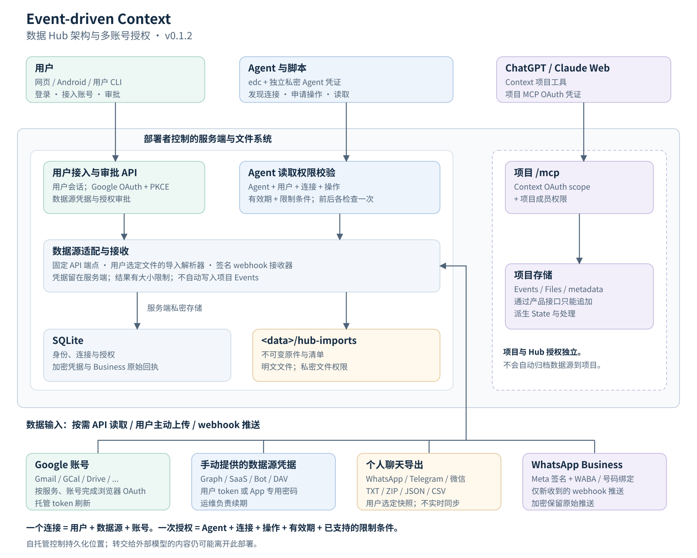
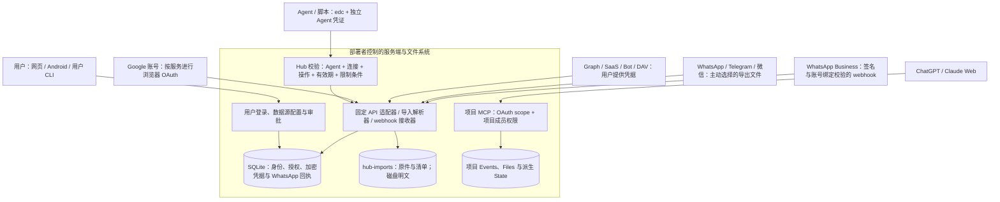
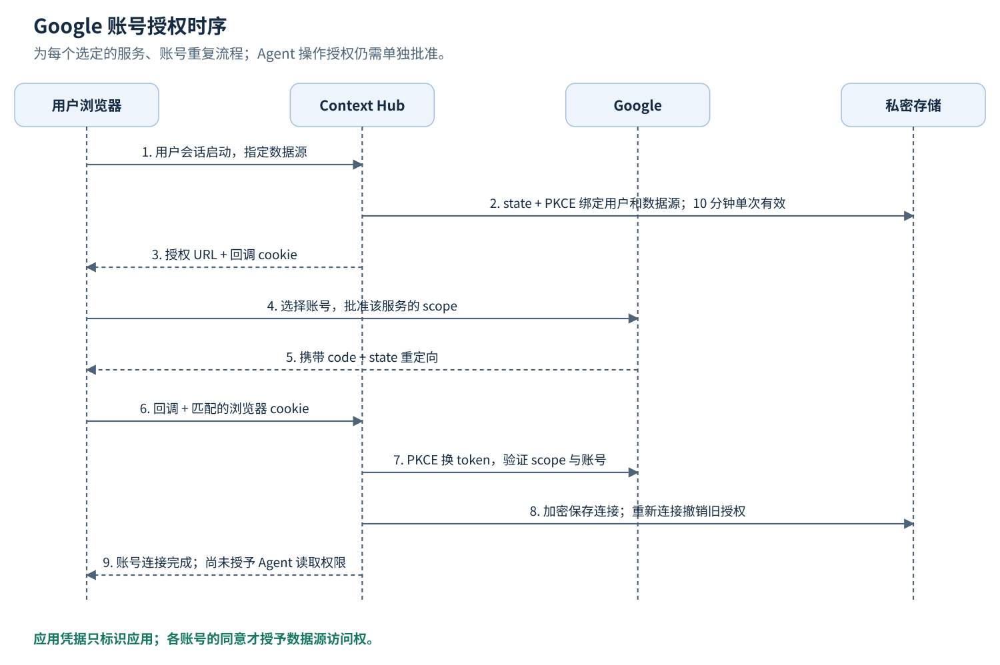
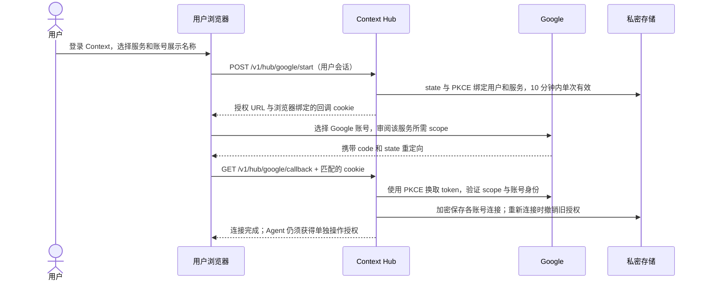
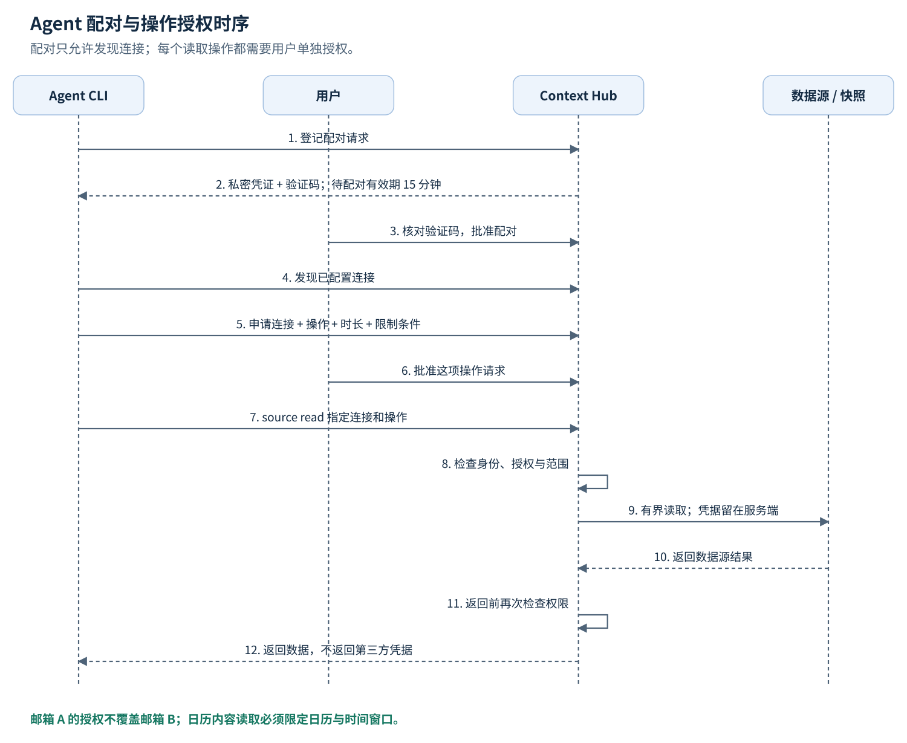
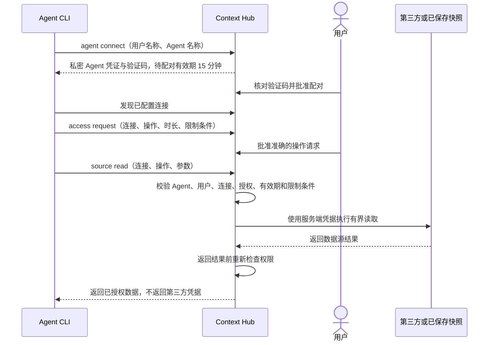

# 数据 Hub 架构与多账号授权

[English](hub-architecture.md) | [简体中文](hub-architecture.cn.md)

Event-driven Context 运行在部署者控制的环境中。数据 Hub 接入多个外部账号，让每个 Agent 申请所需的读取操作。Context 登录、数据源账号连接、Agent 配对和操作授权分别管理。连接一个邮箱，不会自动授权另一个邮箱、日历或 Agent。

本文描述 v0.1.2 的实际实现。适配器已实现、部署配置就绪、账号凭据已保存、真实读取已验证，是不同状态。自托管不依赖维护者的部署；使用示例时将 API 域名替换成自己的地址。

## 架构



[下载 SVG 架构图](assets/hub-architecture.cn.svg)。可编辑的图形生成源码为 [render-hub-diagrams.py](assets/render-hub-diagrams.py)。



Hub 在读取前和返回结果前各检查一次权限。API 适配器使用固定的第三方端点并限制响应大小；API 参数不能指定任意主机或方法。Webhook 接收单独执行第三方签名与账号绑定校验，不依赖 Agent 的读取授权。

ChatGPT 和 Claude Web 通过项目的 `/mcp` 接口访问 Context，使用 Context OAuth 与项目成员权限。这是独立的访问路径：项目 MCP token 不授予 Hub 数据源访问权，Hub Agent token 也不授予项目或用户权限。Hub 读取不会自动将数据源内容追加到项目 Events。

## 四种权限

| 权限 | 谁授权 | 能做什么 |
| --- | --- | --- |
| Context 用户登录 | Context 身份系统；第一方网页使用 Integ.Auth | 管理自己的连接、配对 Agent 和审批授权 |
| 数据源账号连接 | 数据源账号持有人，或主动选择文件的用户 | 服务端访问一个数据源账号；仍受第三方 scope、成员权限限制 |
| Agent 配对 | 用户核对 CLI 验证码后批准 | Agent 可发现该用户已配置的连接并申请操作；此时还不能读取内容 |
| 操作授权 | 用户批准一项请求 | 一个 Agent 在有效期内，对一个连接执行一个操作，并遵守已支持的限制条件 |

部署凭据标识应用，不等于用户同意。通过 Integ.Auth 的 Google 登录只能识别用户，不会授予 Gmail 或 GCal 数据读取权。

## 多账号如何隔离

连接以 `(owner_id, provider_id, account_id)` 唯一标识，每个连接都有自己的 `connection_id`，授权绑定这个 ID。同一个 Context 用户可以有以下三个独立连接：

| 数据源 | 外部账号 | 连接 | 授权示例 |
| --- | --- | --- | --- |
| `gmail` | Google 账号 A | `CONNECTION_MAIL_A` | Agent X / `messages.list` |
| `gmail` | Google 账号 B | `CONNECTION_MAIL_B` | 另行批准前没有读取权 |
| `google-calendar` | Google 账号 A | `CONNECTION_CAL_A` | Agent X / `events.list`，限定日历和时间窗口 |

浏览器 OAuth 回调会验证第三方身份：Gmail 使用 profile 邮箱；Calendar 等已支持的 Google 个人服务使用 OpenID `sub`；Drive 使用 `permissionId`，缺失时回退到邮箱。因此不能假定所有 `account_id` 都是邮箱。手动配置 token 和文件导入的账号标识由用户声明；标签本身不能验证第三方账号归属。

`display_name` 只是展示名称。改名不能创建第二个账号身份或权限边界。再次提交相同用户、数据源、账号，会重新配置原连接并撤销该连接先前待审批及已批准的操作授权。不同 Context 用户即使使用同一个外部账号，也各自拥有独立连接。

## 不同数据源的接入方式

| 数据源 | 当前接入方式 | 数据获取与续期 |
| --- | --- | --- |
| Gmail、GCal、Drive、Tasks、Contacts、Docs、Sheets、Chat | 为选定服务和账号逐次完成浏览器 OAuth；也支持手动 access token | 按需调用官方 API；托管 Google OAuth 凭据支持刷新 |
| Outlook、OneDrive、Microsoft Calendar、Contacts、To Do、OneNote、Teams | 用户提供具备相应权限的 Graph token | 按需读取；受租户策略和成员权限限制；token 续期由运维处理 |
| Notion、Slack、GitHub、GitLab、Asana、Airtable、Linear、Box、Dropbox、Todoist、Readwise | 用户提供对应 token 或 API key | 按需读取；这些适配器没有内置浏览器 OAuth 或自动刷新 |
| Telegram Bot、Discord Bot、飞书、Lark | 按目录要求提供 bot、user 或 tenant token | 读取机器人或工作区可见的数据；Bot API 不能提供个人账号聊天历史 |
| CalDAV、CardDAV、iCloud Calendar/Contacts | 用户提供集合 URL 和用户名、密码；iCloud 使用 App 专用密码 | 按需读取集合；不使用 Apple 主密码 |
| RSS/Atom | 用户选择受支持的 feed URL | 读取公开 feed，受 feed 适配器限制 |
| WhatsApp 个人聊天 | 用户主动导入选定聊天的 TXT 或 ZIP | 不可变快照；没有个人实时会话或持续历史同步 |
| Telegram 个人聊天 | 用户导入 Telegram Desktop JSON | 不可变快照；尚未实现个人 MTProto/TDLib 登录 |
| 微信 | 用户导入整理好的可读 CSV | 不可变快照；没有实时登录或原生加密备份解密 |
| 日历文件与 Markdown | 用户导入 ICS 或 Markdown | 不可变快照；ICS 不展开重复日程 |
| WhatsApp Business | 用户配置 Meta app secret、验证 token、WABA 与号码，并订阅 webhook | 保留新收到的签名推送；不读取个人历史、不发消息、不下载媒体 |

执行 `edc source catalog --available-only` 查看当前已实现目录，执行 `edc source operations --provider PROVIDER_ID` 查看准确的 scope、凭据格式和操作。详细信息见[连接器说明](hub-connectors.cn.md)、[CLI 接入](data-source-cli.cn.md)和[消息接入状态](hub-messaging-readiness.cn.md)。

## Google 每个账号如何授权





部署者控制的一个 Google OAuth Web 应用可以服务多个账号。启用所需 API，按应用状态配置 consent audience 和测试用户，并登记准确的 Context 回调。client ID/secret 留在私密服务端配置中，每个账号的 access/refresh 凭据独立保存。Google 要求登记 redirect URI，并按服务申请 scope；参见 [Google Web Server OAuth 文档](https://developers.google.com/identity/protocols/oauth2/web-server)和 [scope 列表](https://developers.google.com/identity/protocols/oauth2/scopes)。

可以沿用 Integ.Auth 已有的 Google client，同时新增 Context 数据回调，并保留登录回调。维护者部署的两条路径分别为：

```text
身份登录： https://auth.integ.life/oauth/google/callback
数据 Hub： https://context-api.integ.life/v1/hub/google/callback
```

Hub 使用 `EDC_HUB_GOOGLE_CLIENT_ID`、`EDC_HUB_GOOGLE_CLIENT_SECRET`、`EDC_HUB_GOOGLE_REDIRECT_URL` 和既有 `EDC_HUB_CREDENTIAL_KEY`，不会把 Integ.Auth 登录会话当作邮箱 token。`GET /v1/hub/google/status` 只表示本地配置是否就绪；`configured: true` 不证明 Google 已登记回调或已完成真实同意。部署步骤见 [Google Hub 应用配置](google-hub-setup.cn.md)。

先完成账号 A 的 Gmail 授权，再为账号 B 的 Gmail 重复流程；需要哪个账号的 Calendar，就再为该账号启动一次独立流程。CLI 打开用户的 Hub 页面，由同一浏览器启动并完成 OAuth，以便回调 cookie 匹配。服务端在托管 Google token 临近过期时刷新；第三方同意被撤销或 refresh token 不可用时，需要用户重新连接。

## Agent 配对与读取





待配对请求有效期为 15 分钟。批准后，Agent 获得七天的发现权限。操作请求期限为 60 秒至七天，不能超过 Agent 有效期；从请求创建时开始计时，不从批准时开始。Agent 不能自我批准，也不能调用仅供用户使用的接口。

Google/Microsoft Calendar 的 `events.list` 和 `freebusy.query` 必须批准一个 `calendar_id` 及不超过七天的正向 RFC3339 日期窗口。读取参数必须使用该日历，且位于已批准窗口内。Gmail 的 `query`、文件 ID 或消息 ID 则只是操作参数，不是已强制执行的逐条记录权限：批准 `messages.list` 就允许对该邮箱执行这个操作，不会只允许申请时提出的搜索条件。`messages.get`、`attachments.get` 等不同操作仍须分别授权。

## CLI 示例

配置使用同一个用户配置文件；读取使用独立的 Agent 配置文件。以下名称只是示例，不代表真实账号已连接。先将 `EDC_SERVER` 设为本地、自托管 API 或远程 HTTPS API。

```sh
export EDC_SERVER=https://YOUR_API
# 用户完成三个独立的浏览器流程，依次选择账号 A、B、A。
edc --config ./owner-private.json source connect --provider gmail --name 'Mail A' --open
edc --config ./owner-private.json source connect --provider gmail --name 'Mail B' --open
edc --config ./owner-private.json source connect --provider google-calendar --name 'Calendar A' --open
edc --config ./owner-private.json source list --owner

# 手动接入的数据源：从私密 stdin 提供凭据。
edc --config ./owner-private.json source add \
  --provider slack --account WORKSPACE_A --name 'Workspace A' \
  --credential-stdin < /PRIVATE/slack-token.txt

# 用户主动选择的个人聊天快照。
edc --config ./owner-private.json source import \
  --provider telegram-import --account ACCOUNT_A --name 'Telegram A' \
  --format telegram-json --file ./result.json

# 用户在 hub.html 分别批准 Agent 配对和操作请求。
edc agent connect --owner OWNER_USERNAME --name 'My Agent' --output ./agent-private.json
edc --config ./agent-private.json source integrations
edc --config ./agent-private.json access request \
  --connection CONNECTION_MAIL_A --operation messages.list \
  --reason 'Find mail for the current task' --duration 1h
edc --config ./agent-private.json source read \
  --connection CONNECTION_MAIL_A --operation messages.list \
  --args '{"query":"newer_than:7d","limit":10}'
```

用户的普通 CLI 登录配置需单独建立，参见[本机启动步骤](../README.cn.md#五分钟本机启动)。真实连接 ID 来自注册表。最后的读取只有在用户批准该操作后才会成功；邮箱 A 的授权不会延伸到邮箱 B。

## 存储与撤销

| 内容 | 保存位置与访问方式 |
| --- | --- |
| 连接与授权 | SQLite 元数据，按用户隔离；这些配置记录可以修改 |
| 数据源 token 与导入引用 | SQLite 中使用 AES-256-GCM 加密，绑定用户和连接；32 字节密钥来自私密部署配置 |
| Agent 凭证 | CLI 配置文件权限 0600；服务端仅保存其哈希；不向 Agent 返回第三方凭据 |
| 导入原件与清单 | `<data>/hub-imports` 下的不可变文件，目录权限 0700、文件权限 0600；部署磁盘上的明文 |
| WhatsApp Business 推送 | SQLite 中加密保存原始回执和标准化事件，校验账号归属并对回执、事件去重 |
| API 读取结果 | 按需返回，不自动归档为项目 Event |

断开连接会清除当前凭据并撤销待审批及已批准的操作授权。重新连接、替换凭据、再次导入快照也会撤销旧操作授权；普通托管 Google token 刷新保留授权。撤销 Agent 会撤销它的待审批及已批准请求。断开连接不等于撤销第三方 OAuth 同意，也不会删除不可变原件和备份。需要时在第三方平台撤销同意。

保持数据库与数据目录的一致性备份，单独保留凭据加密密钥。不迁移数据而换密钥，会导致旧加密数据不可读。自托管控制持久化位置；Agent 或 MCP 客户端转交给外部模型的内容，仍可能进入该模型服务。

## 当前验收边界

v0.1.2 提供 CLI、账号和操作隔离、Google 浏览器 OAuth、固定端点适配器、个人聊天快照导入以及 WhatsApp Business 持久化 webhook 接收。本地测试与发布、部署检查不等于所有列出的数据源均已验证真实访问。真实 OAuth 同意、账号读取、刷新、租户或机器人权限、手机通知到达，都需对应账号或设备验收。参见 [v0.1.2 发布](https://github.com/flyfy1/event-driven-context/releases/tag/v0.1.2)和[消息接入状态](hub-messaging-readiness.cn.md)。

## 实现索引

| 职责 | 源码 |
| --- | --- |
| CLI 命令 | [hub.go](../backend/cmd/edc/hub.go)、[sources.go](../backend/cmd/edc/sources.go) |
| Hub API、执行与用户审批 | [hub.go](../backend/internal/api/hub.go)、[hub_registry.go](../backend/internal/api/hub_registry.go) |
| 连接、Agent 身份、授权与表结构 | [core/hub.go](../backend/internal/core/hub.go)、[hub_schema.sql](../backend/internal/core/hub_schema.sql) |
| Google OAuth 与刷新 | [api/hub_google.go](../backend/internal/api/hub_google.go)、[google_oauth.go](../backend/internal/hubconnectors/google_oauth.go) |
| 日历限制条件 | [hub_constraints.go](../backend/internal/core/hub_constraints.go) |
| 导入与原件来源 | [hub_imports.go](../backend/internal/core/hub_imports.go)、[hub_chat_imports.go](../backend/internal/core/hub_chat_imports.go) |
| WhatsApp 签名与持久化接收 | [hubwebhooks/whatsapp.go](../backend/internal/hubwebhooks/whatsapp.go)、[core/hub_whatsapp.go](../backend/internal/core/hub_whatsapp.go) |
| 用户审批界面 | [hub.js](../frontend/hub.js)、[Android Hub](android-hub.cn.md) |
| 项目 MCP OAuth | [oauth.go](../backend/internal/api/oauth.go) |
