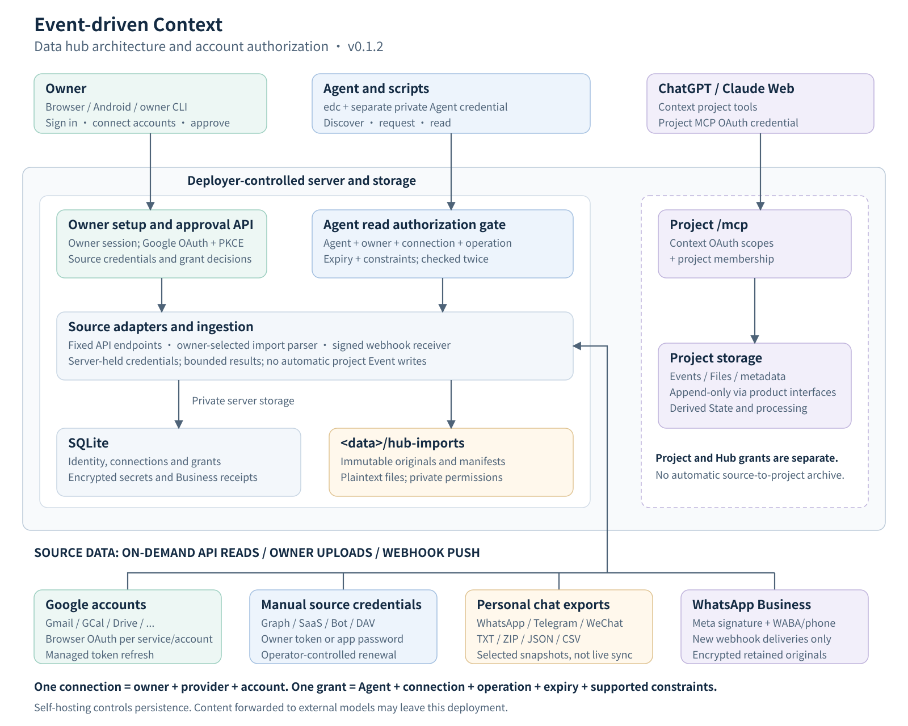
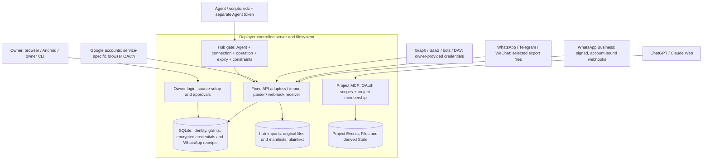
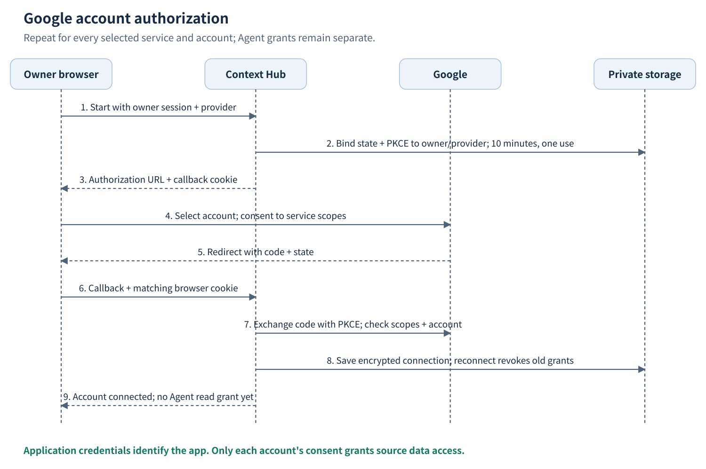
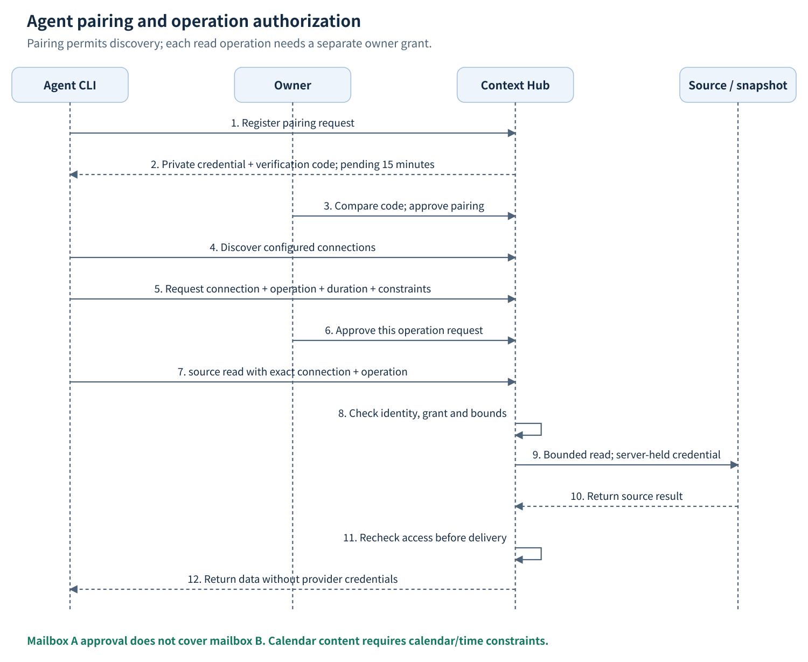
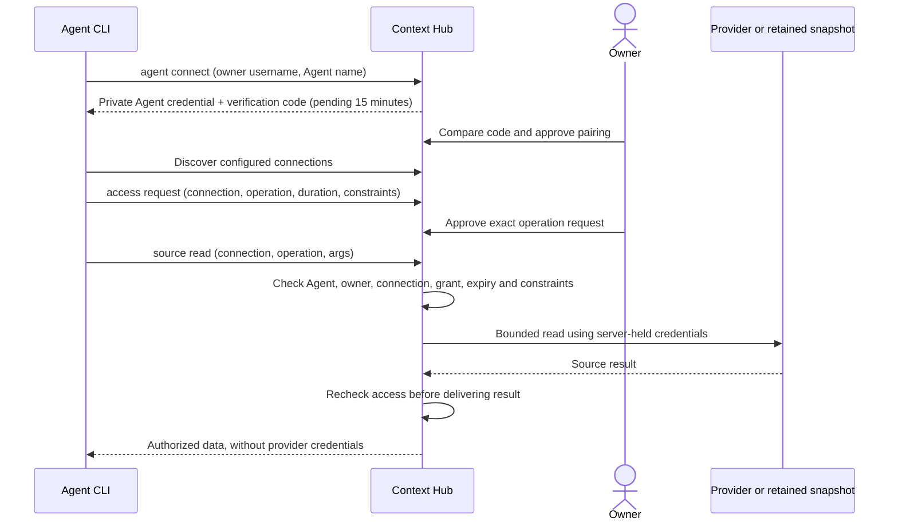

# Data hub architecture and account authorization

[English](hub-architecture.md) | [简体中文](hub-architecture.cn.md)

Event-driven Context runs in an environment controlled by its deployer. The data Hub connects multiple external accounts and lets each Agent request selected read operations. A Context login, a source connection, Agent pairing and an operation grant are separate permissions. Connecting one mailbox does not authorize another mailbox, Calendar or an Agent.

This describes the v0.1.2 implementation. Provider adapters, deployment configuration, saved account credentials and verified live reads are distinct states. The maintainer deployment is optional; replace the example API domain with your own.

## Architecture



[Download the SVG](assets/hub-architecture.svg). The editable diagram generation source is [render-hub-diagrams.py](assets/render-hub-diagrams.py).



The Hub checks authorization before reading a source and again before releasing the result. API adapters use fixed provider endpoints and bounded responses; API arguments cannot select arbitrary hosts or methods. Webhook ingestion uses provider-signature and account-binding checks independently of Agent read grants.

ChatGPT and Claude Web use the project's `/mcp` interface with Context OAuth and project membership. This is a separate access path: a project MCP token does not grant Hub source access, and a Hub Agent token does not grant project or owner access. Hub reads do not automatically append source content to project Events.

## The four permissions

| Permission | Who grants it | What it enables |
| --- | --- | --- |
| Context owner login | Context identity system; the first-party web frontend uses Integ.Auth | Manage this owner's connections, pair Agents and decide grants |
| Source account connection | Source account owner or owner-selected import | Server-side access to one source/account; upstream scopes and membership still apply |
| Agent pairing | Owner checks the CLI verification code and approves | Agent can discover this owner's configured connections and request operations; no content-read permission yet |
| Operation grant | Owner approves one request | One Agent may read one connection using one operation until expiry, subject to supported constraints |

Deployment credentials identify the application. They are not user consent. Integ.Auth's Google sign-in identifies a user; it does not grant Gmail or Calendar data access.

## Multiple accounts

Each connection is unique by `(owner_id, provider_id, account_id)` and has its own `connection_id`. Grants target this ID. For one Context owner, the following are three independent connections:

| Source | External account | Connection | Example grant |
| --- | --- | --- | --- |
| `gmail` | Google account A | `CONNECTION_MAIL_A` | Agent X / `messages.list` |
| `gmail` | Google account B | `CONNECTION_MAIL_B` | No access until separately approved |
| `google-calendar` | Google account A | `CONNECTION_CAL_A` | Agent X / `events.list`, calendar and time window |

The browser OAuth callback verifies the external identity: Gmail uses its profile email; Calendar and other supported Google personal services use OpenID `sub`; Drive uses `permissionId`, with email as fallback. Do not assume every `account_id` is an email address. Manually configured tokens and imports use an owner-declared account label; the label alone does not verify upstream ownership.

`display_name` is a human-readable label. Changing it cannot create a second identity or permission boundary. Submitting the same owner/provider/account again reconfigures the existing connection and revokes its previous pending and approved operation grants. Different owners have separate connections even when using the same external account.

## Connection methods by source

| Sources | Current onboarding | Data and renewal |
| --- | --- | --- |
| Gmail, GCal, Drive, Tasks, Contacts, Docs, Sheets, Chat | Browser OAuth for each selected service/account; manual access tokens also supported | On-demand official API reads; managed Google OAuth credentials support refresh |
| Outlook, OneDrive, Microsoft Calendar, Contacts, To Do, OneNote, Teams | Owner supplies an appropriately scoped Graph token | On-demand reads; tenant policy and membership apply; token renewal is operator-controlled |
| Notion, Slack, GitHub, GitLab, Asana, Airtable, Linear, Box, Dropbox, Todoist, Readwise | Owner supplies provider-specific token/API key | On-demand reads; no built-in browser OAuth or automatic refresh for these adapters |
| Telegram Bot, Discord Bot, Feishu, Lark | Owner supplies bot/user/tenant token as required by the catalog | API-visible bot or workspace data; Bot API access does not provide personal account history |
| CalDAV, CardDAV, iCloud Calendar/Contacts | Owner supplies collection URL and username/password; iCloud uses an app-specific password | On-demand collection reads; no primary Apple password |
| RSS/Atom | Owner selects a supported feed URL | Public feed reads, bounded by the feed adapter |
| Personal WhatsApp | Owner imports selected chat TXT or ZIP | Immutable snapshot; no live personal session or continuous history sync |
| Personal Telegram | Owner imports Telegram Desktop JSON | Immutable snapshot; personal MTProto/TDLib login is not implemented |
| WeChat | Owner imports prepared readable CSV | Immutable snapshot; no live login or native encrypted-backup decryption |
| Calendar files and Markdown | Owner imports ICS or Markdown | Immutable snapshot; ICS recurrences are not expanded |
| WhatsApp Business | Owner configures Meta app secret, verification token, WABA and phone; subscribes webhook | Retains new signed deliveries; no personal history, outbound messaging or media download |

Use `edc source catalog --available-only` for the current implemented catalog and `edc source operations --provider PROVIDER_ID` for exact scopes, credential shapes and operations. See [connector details](hub-connectors.md), [CLI setup](data-source-cli.md) and [messaging readiness](hub-messaging-readiness.md).

## Google OAuth for each account



```mermaid
sequenceDiagram
    actor Owner
    participant Browser as Owner browser
    participant Hub as Context Hub
    participant Google
    participant Store as Private storage
    Owner->>Browser: Sign in to Context; select service and account label
    Browser->>Hub: POST /v1/hub/google/start (owner session)
    Hub->>Store: Bind one-use state and PKCE to owner/provider (10 minutes)
    Hub-->>Browser: Authorization URL + browser-bound callback cookie
    Browser->>Google: Select Google account; review requested service scopes
    Google-->>Browser: Redirect with code and state
    Browser->>Hub: GET /v1/hub/google/callback + matching cookie
    Hub->>Google: Exchange code with PKCE; verify scopes and account identity
    Hub->>Store: Save encrypted per-account connection; revoke old grants on reconnect
    Hub-->>Browser: Connected; Agent grants still require owner approval
```

One deployer-controlled Google OAuth Web application can serve many accounts. Enable the selected APIs, configure the consent audience/test users where required, and register the exact Context callback. The client ID/secret remain in private server configuration; each account gets separately stored access/refresh credentials. Google requires registered redirect URIs and service-specific scopes; see [Google's web-server OAuth documentation](https://developers.google.com/identity/protocols/oauth2/web-server) and the [scope reference](https://developers.google.com/identity/protocols/oauth2/scopes).

An existing Integ.Auth Google client can be reused with an additional registered callback, while retaining its login callback. For the maintainer deployment these are distinct routes:

```text
Identity login:  https://auth.integ.life/oauth/google/callback
Data Hub:        https://context-api.integ.life/v1/hub/google/callback
```

The Hub uses `EDC_HUB_GOOGLE_CLIENT_ID`, `EDC_HUB_GOOGLE_CLIENT_SECRET`, `EDC_HUB_GOOGLE_REDIRECT_URL` and the existing `EDC_HUB_CREDENTIAL_KEY`. It does not reuse an Integ.Auth login session as a mailbox token. `GET /v1/hub/google/status` reports local configuration readiness; `configured: true` does not prove callback registration or successful consent. Setup steps are in [Google Hub application setup](google-hub-setup.md).

Complete account A's Gmail flow, repeat for account B's Gmail, and start a separate Calendar flow for each desired account. The CLI opens the owner's Hub page; the browser starts and completes OAuth so the callback cookie stays in the same browser. The server refreshes managed Google tokens near expiry. Revoked consent or an unusable refresh token requires the owner to reconnect.

## Agent pairing and reads





Pending pairing lasts 15 minutes. Approval permits Agent discovery for seven days. An operation request lasts 60 seconds to seven days, capped by the Agent's expiry; the duration starts when the request is created, not when approved. The Agent cannot approve itself or access owner-only routes.

For Google/Microsoft Calendar `events.list` and `freebusy.query`, approval requires a `calendar_id` and a positive RFC3339 date window of at most seven days. Read arguments must use that calendar and stay inside the approved window. A Gmail `query`, file ID or message ID is otherwise an operation argument, not an enforced record-level permission boundary: `messages.list` approval applies to that operation on that mailbox, not only to a proposed search string. Different operations such as `messages.get` and `attachments.get` require separate grants.

## CLI examples

Use one owner configuration for setup and a separate Agent configuration for reads. These are illustrative names, not actual connected accounts. Set `EDC_SERVER` to your local/self-hosted API or an HTTPS remote API first.

```sh
export EDC_SERVER=https://YOUR_API
# Owner completes three separate browser flows, choosing A, B and A respectively.
edc --config ./owner-private.json source connect --provider gmail --name 'Mail A' --open
edc --config ./owner-private.json source connect --provider gmail --name 'Mail B' --open
edc --config ./owner-private.json source connect --provider google-calendar --name 'Calendar A' --open
edc --config ./owner-private.json source list --owner

# A manually configured source: supply credentials privately through stdin.
edc --config ./owner-private.json source add \
  --provider slack --account WORKSPACE_A --name 'Workspace A' \
  --credential-stdin < /PRIVATE/slack-token.txt

# An owner-selected personal chat snapshot.
edc --config ./owner-private.json source import \
  --provider telegram-import --account ACCOUNT_A --name 'Telegram A' \
  --format telegram-json --file ./result.json

# Agent pairing and operation approval are separate owner actions in hub.html.
edc agent connect --owner OWNER_USERNAME --name 'My Agent' --output ./agent-private.json
edc --config ./agent-private.json source integrations
edc --config ./agent-private.json access request \
  --connection CONNECTION_MAIL_A --operation messages.list \
  --reason 'Find mail for the current task' --duration 1h
edc --config ./agent-private.json source read \
  --connection CONNECTION_MAIL_A --operation messages.list \
  --args '{"query":"newer_than:7d","limit":10}'
```

The owner's normal CLI login configuration is established separately; see the [local startup instructions](../README.md#run-locally-in-five-minutes). Real connection IDs come from the registry. The final read succeeds only after the owner approves its operation; approval of mailbox A does not extend to mailbox B.

## Storage and revocation

| Item | Persistence and access |
| --- | --- |
| Connections and grants | SQLite metadata, isolated by owner; these configuration records can change |
| Source tokens and import references | AES-256-GCM encrypted in SQLite, bound to owner and connection; 32-byte key in private deployment configuration |
| Agent credential | Mode-0600 CLI configuration; only its hash is stored server-side; provider credentials are not returned to Agents |
| Imported originals and manifests | Immutable files under `<data>/hub-imports`, directory mode 0700/file mode 0600; plaintext on the deployer's disk |
| WhatsApp Business deliveries | Encrypted original receipts and normalized events in SQLite; receipt/event deduplication and account binding |
| API read responses | Returned on demand; no automatic project Event archive |

Disconnecting a connection clears its active credential and revokes pending/approved operation grants. Reconnecting, replacing credentials or reimporting a snapshot also revokes old operation grants; ordinary managed Google token refresh preserves them. Revoking an Agent revokes its pending/approved requests. Disconnect does not revoke upstream OAuth consent or delete immutable originals and backups. Revoke provider consent at the provider when required.

Keep a consistent database/data-directory backup and preserve the credential key separately. Changing the key without migration makes stored encrypted data unreadable. Self-hosting controls persistence location; content forwarded by an Agent or MCP client to an external model can enter that model provider's service.

## Current acceptance boundary

v0.1.2 provides the CLI, account/operation isolation, Google browser OAuth, fixed-endpoint adapters, personal-chat snapshot imports and durable WhatsApp Business webhook ingestion. Local tests and release/deployment checks do not establish live access to every listed provider. Real OAuth consent, account reads, refresh, tenant/bot permissions and mobile notification delivery require their own account/device acceptance. See [release v0.1.2](https://github.com/flyfy1/event-driven-context/releases/tag/v0.1.2) and [messaging readiness](hub-messaging-readiness.md).

## Implementation map

| Responsibility | Source |
| --- | --- |
| CLI commands | [hub.go](../backend/cmd/edc/hub.go), [sources.go](../backend/cmd/edc/sources.go) |
| Hub API, execution and owner decisions | [hub.go](../backend/internal/api/hub.go), [hub_registry.go](../backend/internal/api/hub_registry.go) |
| Connections, Agent identity, grants and schema | [core/hub.go](../backend/internal/core/hub.go), [hub_schema.sql](../backend/internal/core/hub_schema.sql) |
| Google OAuth and refresh | [api/hub_google.go](../backend/internal/api/hub_google.go), [google_oauth.go](../backend/internal/hubconnectors/google_oauth.go) |
| Calendar constraints | [hub_constraints.go](../backend/internal/core/hub_constraints.go) |
| Imports and original provenance | [hub_imports.go](../backend/internal/core/hub_imports.go), [hub_chat_imports.go](../backend/internal/core/hub_chat_imports.go) |
| WhatsApp signature and durable ingestion | [hubwebhooks/whatsapp.go](../backend/internal/hubwebhooks/whatsapp.go), [core/hub_whatsapp.go](../backend/internal/core/hub_whatsapp.go) |
| Owner approval interface | [hub.js](../frontend/hub.js), [Android Hub](android-hub.md) |
| Project MCP OAuth | [oauth.go](../backend/internal/api/oauth.go) |
