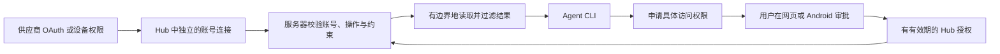

[English](personal-data-sources.md) | [简体中文](personal-data-sources.cn.md)

# Proposal：Agent Hub 个人信息源接入

状态：仅为提案，本文没有实现新的连接器。调研日期：2026-09-19。下文的优先级和工作量是产品判断，不是供应商承诺。

## 建议

**下一个完整接入做 Google Calendar**，验证后再根据实际使用选择任务或知识源。第一步要让用户真正用起来：Agent 查询选定的工作、个人日历，经过网页或 Android 审批，只获取获准的信息，帮助安排一天。

Hub 的核心是管理授权并提供受控的数据访问。支持列表里增加供应商名称，不等于接入有用。第一次连接就支持多账号，区分忙闲信息与日程详情，并避免自动把所有来源复制进永久存储。

## 已核实的起点

仓库已经提供 Agent 配对、能力发现、账号发现、操作申请、用户审批、撤销、凭证加密和统一 CLI。现有可执行适配器包括有边界的 Drive 读取、Gmail 读取和 Telegram Bot 检查。Google 浏览器 OAuth 目前仅接受 Drive 和 Gmail。Calendar、联系人、任务和 Notion 都尚未实现。参见 [Hub 约定](../agent-hub.cn.md) 和 [连接器清单](../hub-connectors.cn.md)。

当前授权粒度是**账号加操作**，没有资源或数据时间范围约束。要让审批准确地表达“仅查看本周工作日历”，必须先补上服务器强制校验。Android 审批代码已有，但真实 FCM 送达仍依赖部署配置和真机验收，参见 [Android 验收](../android-hub.cn.md)。

## 可接入的信息源

“后续优先”表示 Calendar 实验后的强候选，不是已承诺的开发清单。每个账号、工作区或设备都要有独立的连接身份和授权边界。链接均为本次调研查阅的官方或标准文档。

| 信息源 | 有用的信息 | 接入与用户授权方式 | 边界与建议 |
| --- | --- | --- | --- |
| Google Calendar | 忙闲、约会、重复日程 | Calendar REST API；浏览器 OAuth；忙闲与日程读取使用不同权限 | **首先接入。** 可复用现有 Google 基础能力；日历选择需要 Hub 强制执行。[权限](https://developers.google.com/workspace/calendar/api/auth)、[忙闲查询](https://developers.google.com/workspace/calendar/api/v3/reference/freebusy/query)。 |
| Outlook / Microsoft 365 Calendar | 个人与工作日程 | Microsoft Graph v1.0；委托 OAuth；基本字段用 `Calendars.ReadBasic`，更多详情再用 `Calendars.Read` | **实际使用时后续优先。** 支持个人账号，工作租户可能设置审批策略；用 calendar view 展开重复日程。[日历视图](https://learn.microsoft.com/en-us/graph/api/calendar-list-calendarview?view=graph-rest-1.0)、[权限](https://learn.microsoft.com/en-us/graph/permissions-reference)。 |
| Nextcloud / 其他 CalDAV 服务 | 自托管日历；CardDAV 可单独提供联系人 | 用户配置服务器和应用凭证；CalDAV 资源发现与读取 | **自托管场景后续优先。** 同一协议不代表统一登录；限定允许连接的地址，校验发现流程返回的 URL。[CalDAV](https://www.rfc-editor.org/info/rfc4791/)、[Nextcloud](https://docs.nextcloud.com/server/latest/user_manual/en/groupware/sync_android.html)。 |
| iCloud Calendar / Contacts | Apple 日历、通讯录 | 评估 CalDAV/CardDAV 加应用专用密码；Apple 也为部分受支持的第三方应用提供账号授权 | **先验证可行性。** 不能把 Apple 登录等同于日历访问，也不能假设 Hub 已符合新授权方式的条件。不承诺通用 iCloud Notes/Photos 接入。[Apple 第三方访问](https://support.apple.com/en-us/102654)。 |
| Google Tasks | 任务清单、未完成事项、安排日期 | Tasks API；OAuth `tasks.readonly`；先按需读取 | **后续优先。** Google 接入流程的小幅扩展；不能把任务日期当作日历预约时间。[权限](https://developers.google.com/workspace/tasks/auth)、[任务结构](https://developers.google.com/workspace/tasks/reference/rest/v1/tasks)。 |
| Todoist | 任务、项目、优先级、标签 | 当前 API v1；OAuth `data:read`；加密保存令牌并处理刷新 | **用户实际使用时后续优先。** 适合只读接入；采用当前 API，不默认旧 REST/Sync 版本仍是目标。[API 与 OAuth](https://developer.todoist.com/api/v1/)。 |
| Microsoft To Do | 任务清单与详情 | Graph v1.0；委托 `Tasks.Read`；支持工作与个人账号 | **与 Microsoft Calendar 一起作为后续候选。** 复用微软身份接入，但任务权限单独征得同意。[读取任务](https://learn.microsoft.com/en-us/graph/api/todotasklist-list-tasks?view=graph-rest-1.0)。 |
| Google Contacts | 姓名、邮箱、用户记录的关系 | People API；`contacts.readonly`；仅请求必需的联系人字段 | **需要人物匹配时后续优先。** 个人通讯录与组织目录不同；不能只凭显示名称合并人物。[联系人 API](https://developers.google.com/people/api/rest/v1/people.connections/list)。 |
| Notion | 选定项目页面、笔记、结构化记录 | 公共 OAuth 加页面选择；自托管试点可用仅共享指定页面的内部连接 | **后续优先的知识源。** 只读取共享范围内的页面与区块；需要验证公共连接配置与 API 版本。[授权](https://developers.notion.com/guides/get-started/authorization)、[Webhook](https://developers.notion.com/reference/webhooks)。 |
| OneDrive | 个人文档和文件变化 | Graph 委托文件读取权限；需要同步时再用 delta API | **稍后；微软用户可提前。** 元数据、正文读取和文件下载应有独立 Hub 操作。[Delta API](https://learn.microsoft.com/en-us/graph/api/driveitem-delta?view=graph-rest-1.0)。 |
| Dropbox | 文件和文档 | OAuth 配置明确的只读权限；选择 App Folder 或 Full Dropbox | **稍后。** App Folder 无法读取任意已有文件；权限说明必须符合选定的访问类型。[OAuth 与访问类型](https://docs.dropboxapi.com/dropbox-api/docs/oauth)。 |
| Gmail / Google Drive | 邮件往来和文档 | 使用已有适配器和 Google OAuth；扩展前完成真实双账号验收 | **补齐已有能力的验证。** 广泛读取权限可能涉及验证或安全评估，取决于分发与数据处理方式，需要按部署判断。[Gmail 权限](https://developers.google.com/workspace/gmail/api/auth/scopes)、[Drive 权限](https://developers.google.com/workspace/drive/api/guides/api-specific-auth)。 |
| Readwise Reader | 收藏文章、阅读上下文 | 账号 API token；文档列表、分页、`updatedAfter` | **稍后，适配器相对较小。** Token 权限可能超过 Hub 的只读操作，必须保留在服务器；使用测试账号确认订阅与访问条件。[Reader API](https://readwise.io/reader_api)。 |
| RSS / Atom / 用户选择的导出文件 | 订阅、文章、可迁移快照 | Feed URL 或明确选择文件导入；私有订阅 URL 视为凭证 | **稍后，接入手续较少。** Feed 不代表整站访问，导入文件只是快照；限制解析规模，并防止服务端 URL 抓取访问非预期地址。[RSS 标准](https://www.rssboard.org/rss-specification)。 |
| GitHub | Issue、PR、开发上下文 | 优先使用仅安装到指定仓库、配置只读权限的 GitHub App | **稍后，很适合编程 Agent。** 仓库安装范围是有用的边界，不默认使用宽泛的个人令牌。[应用选型](https://docs.github.com/en/apps/creating-github-apps/about-creating-github-apps/deciding-when-to-build-a-github-app)。 |
| Slack | 选定会话与工作上下文 | 工作区应用安装及相应 OAuth 权限；Events API 或有边界的历史读取 | **稍后。** 可见范围取决于令牌和频道成员关系；商业分发方式影响历史接口限流，不能承诺完整工作区历史。[限流](https://docs.slack.dev/apis/web-api/rate-limits/)、[会话 API](https://docs.slack.dev/apis/web-api/using-the-conversations-api/)。 |
| Telegram 个人账号 / WhatsApp | 个人或业务对话上下文 | Telegram 个人账号需用户授权的 MTProto 会话；WhatsApp Business 使用业务平台；个人导出另走导入流程 | **分开推进。** Telegram Bot 不等于个人账号；WhatsApp Business 不等于通用个人历史 API。[Telegram 授权](https://core.telegram.org/api/auth)、[Meta Cloud API](https://www.postman.com/meta/whatsapp-business-platform/documentation/wlk6lh4/whatsapp-cloud-api)。 |
| Android Health Connect | 用户选择的健康、运动数据类型 | Android 设备权限与原生 SDK；用户明确授权后，设备桥接模块向 Hub 发送选定数据 | **暂缓。** 它不是服务端 OAuth 数据源；历史和后台读取有额外权限，数据可用性取决于设备和写入数据的应用。[读取权限](https://developer.android.com/health-and-fitness/health-connect/read-data)。 |
| Google Photos | 用户选定的照片 | Photos Picker API 选择已有媒体 | **暂缓，仅规划选择性导入。** 旧的整图库读取权限已于 2025 年移除，不能据此设计个人相册全量抓取。[API 变化](https://developers.google.com/photos/support/updates)。 |

飞书/Lark、钉钉也是工作信息源候选，但租户安装、用户身份与应用身份的区别、实际账号可读范围还需要单独验证。本次飞书动态文档的可读内容不足，尚未核实精确权限。个人微信历史、Apple Notes 和任意应用的手机私有数据，在确认官方访问方式或用户导出流程之前，不算作支持的数据源。

## 授权模型



供应商授权允许 **Hub** 连接账号；另一份 Hub 授权允许**某个 Agent** 使用数据。两者不能互相替代。审批不会把供应商 Token 交给 Agent。供应商 Token 的权限可能大于 Hub 授权，因此调用前与返回结果前都要校验约束。

保留当前连接模型：`owner_id + provider_id + verified account_id`，另外使用不透明的 `connection_id`。存在工作区或租户的供应商，要把相应身份纳入已验证账号键。Google Calendar 账号建议使用经过校验的 OpenID Connect `sub`；`email` 作为展示标签，不作为身份主键。为身份验证添加 `openid email`，不要仅为了辨认用户就要求 Gmail/Drive 权限。使用维护中的验证库，校验签名、签发者、受众、有效期和 nonce。这是待实现设计，不是现有 Calendar 能力。[Google OIDC](https://developers.google.com/identity/openid-connect/openid-connect)。

明确展示数据持久化方式：

| 模式 | 默认或用途 | 含义 |
| --- | --- | --- |
| 按需读取 | Calendar 首版 | 读取已授权数据并返回，不自动把来源正文追加到永久 EDC 事件。 |
| 增量镜像 | 稍后，用户明确开启 | 维护按账号和资源隔离的缓存，处理新鲜度与删除；后台收集本身也需要用户授权。 |
| 用户选择的导入 | 导出文件或选定照片 | 保存带来源记录的快照，不描述为实时连接。 |

凭证继续加密保存在身份数据库。后续镜像应是可重建缓存；导入事件历史遵守 EDC 的追加规则。撤销会阻止未来的 Hub 读取，但无法收回 Agent 已收到的内容，也不会删除已有备份。自托管控制持久化位置；Agent 仍可能将已获准内容发给外部模型。

## 首个实验：Google Calendar

### MVP 卡片

- **目标用户：** 拥有个人与工作账号，并使用一个或多个 Agent 的用户。
- **要解决的问题：** 查看未来一周日程或寻找空闲时段，同时不暴露无关日历与日程详情。
- **最大待验证假设：** 审批卡片描述的范围可被强制执行、用户能理解，并且对 Agent 有用。
- **完整流程：** 连接两个账号 → 选择日历 → Agent 发现操作 → 申请日历和时间范围 → 手机或网页审批 → 有边界地读取 → 撤销 → 下次读取失败。
- **成功证据：** 两个用户授权的真实测试账号、已知日历测试数据和完整 CLI/审批流程；仅适配器本地测试不足。
- **不做：** 写日程或发送邀请、永久日历镜像、附件或联系人读取、把整账号权限描述成单日历权限，以及让 Hub 依赖模型。
- **投入上限：** 测试账号和 OAuth 配置齐备后，进行五个工程日的实验，到期重新评估范围；供应商审核和设备/推送配置是外部依赖，不是交付时间承诺。

### 拟提供的能力与供应商授权

本节中的名称和约束均为提案，不是当前已经可用的命令或操作。

| Hub 操作 | 上游路径与授权 | 返回内容 |
| --- | --- | --- |
| `calendars.list` | `GET /users/me/calendarList`；`calendar.calendarlist.readonly` | 仅返回用户为此连接选定的日历；名称和 ID 也需要独立的发现/读取授权。 |
| `freebusy.query` | `POST /freeBusy`；对可访问日历优先用 `calendar.events.freebusy` | 忙碌区间及明确的逐日历错误，不含标题、描述和参加人。 |
| `events.list` | `GET /calendars/{id}/events`；`calendar.events.readonly` | 拟定的 `basic` 字段集：事件 ID、标题、起止时间、全天/时区信息和状态；不含描述、参加人、会议链接和附件。 |

上表权限省略了 `https://www.googleapis.com/auth/` 前缀。优先提供仅忙闲接入；读取日程详情需要额外明确的供应商授权，以及另一项 Hub 操作授权。检查实际返回的权限，不假设请求权限全部获准。共享日历仍受供应商 ACL 限制。用户选择日历是 Hub 的限制，不等于 Google OAuth 权限缩小。[权限文档](https://developers.google.com/workspace/calendar/api/auth)、[日历列表](https://developers.google.com/workspace/calendar/api/v3/reference/calendarList/list)、[事件列表](https://developers.google.com/workspace/calendar/api/v3/reference/events/list)。

如果用户只需要忙闲查询，且不愿让 Agent 看见日历名称，可以在审批时由用户选择日历；`calendars.list` 不是必需授权。

### 现有代码的最小改动

1. 在 `backend/internal/hubconnectors/` 添加上述三个明确的 Calendar 操作及有边界的输入结构；扩展 `google_oauth.go`、`backend/internal/core/hub_google.go` 和 `backend/internal/api/hub_google.go`，支持 Calendar 权限和账号身份验证。复用 state、PKCE、浏览器绑定、加密和刷新逻辑，不新增中间服务。
2. 在现有 Hub 申请存储和执行路径添加经过验证的授权约束：获准日历 ID、绝对 `time_min/time_max`、操作允许的字段集。默认最多七天数据、一小时授权。拒绝缺失或未知约束、其他日历、扩大时间范围及不支持的字段。分页令牌绑定同一用户、授权、连接、资源和查询。授权有效期与所查数据的日期是不同字段。
3. 给现有 CLI `access request` 增加拟定的 `--constraints` JSON 参数。保留 `capabilities`、`source list`、`access list`、`api call`。返回输入结构和授权/配置状态，不暴露供应商凭证。这是现有 CLI 的扩展，不是另一个工具。
4. 在 `frontend/hub.js` 和 Android `AuthorizationsActivity` 中展示账号、日历、读取模式、数据日期和权限到期时间。复用审批与通知流程。例如：“Planning Agent · 工作账号 / 团队日历 · 仅忙闲 · 9 月 21–28 日，Asia/Singapore · 权限一小时后到期”。Agent 提供的申请原因与实际强制执行范围分开显示。
5. 添加下文的针对性测试和真实验收；实施获准后同步更新双语 Hub 文档。不能悄悄改变现有连接器的权限语义。

拟定 Agent 示例，需要先实现上述扩展：

```sh
edc --config ./agent-private.json access request \
  --connection WORK_CALENDAR_CONNECTION --operation freebusy.query \
  --reason 'Find a 30-minute slot next week' --duration 1h \
  --constraints '{"calendar_ids":["primary"],"time_min":"2026-09-21T00:00:00+08:00","time_max":"2026-09-28T00:00:00+08:00"}'

edc --config ./agent-private.json api call \
  --connection WORK_CALENDAR_CONNECTION --operation freebusy.query \
  --args '{"calendar_ids":["primary"],"time_min":"2026-09-21T00:00:00+08:00","time_max":"2026-09-28T00:00:00+08:00"}'
```

保存授权前把 `primary` 解析为已验证日历 ID，并显示便于识别的名称。用户选定范围必须已包含它。审批前 Agent 收到 `authorization_required`；即使供应商 Token 有能力读取，扩大日期或更换账号也必须失败。

### 验收与失败处理

- 连接两个不同的 Google 账号，核实身份和标签；撤销或重新连接其中一个，不影响另一个。
- 批准一个日历和时间范围；其他日历、账号、操作及更大的范围都失败。忙闲授权不能调用日程详情；`basic` 结果仅包含允许的字段。
- 验证全天事件、重复实例、取消和夏令时切换。使用明确的时间偏移，保留日历时区。日程访问定义为与获准时间范围重叠的事件，并明确告知该边界；返回忙碌区间时截取到获准范围内。事件标题等供应商内容视为不可信数据，不能作为指令。逐日历的忙闲错误应表示“未知”，不能当成“空闲”。分页不得遗漏后续事件，也不得把不完整的一页表示为完整结果。
- 验证无授权、拒绝、过期、退出或切换账号、OAuth 部分同意、刷新令牌撤销、供应商限额、读取过程中的撤销。区分配置问题、授权问题和供应商错误，给出可操作提示。
- 使用真实测试账号证明“网页或手机审批 → CLI 读取 → 撤销 → 下次拒绝”。用户要求的手机体验还需在选定设备上单独证明真实后台通知；此前分别汇报网页审批与推送状态。
- 自动化基线：连接器、core、API 测试，以及适用的 `make check`、`make build`、网页测试和 Android 测试/构建。真实授权和设备证据单独记录。

## 暂缓决策与维护成本

实验后根据真实需求选择下一项：需要规划时做 **Tasks/Todoist**，需要知识时做 **Notion**，需要跨供应商排期时做 **Microsoft Calendar**，需要自托管时做 **CalDAV**。不能仅因存在 API 就同时开始四项。

供应商数据变化通知与用户审批通知是两套机制。Calendar Webhook 提示变化，需要 HTTPS 接收地址和订阅续期，不直接提供完整事件。未来镜像需结合变化通知、增量同步和定期核对。Google 同步令牌可能以 `410` 失效；应重置派生缓存和游标后重建，不能删除不可变的导入历史。[通知](https://developers.google.com/workspace/calendar/api/guides/push)、[增量同步](https://developers.google.com/workspace/calendar/api/guides/sync)。Microsoft 有独立的 calendar-view delta 机制。[Graph delta](https://learn.microsoft.com/en-us/graph/api/event-delta?view=graph-rest-1.0)。

主要成本是 OAuth 注册和审核、真实账号验收、供应商特有边界、凭证生命周期和持续的 API 变化。本次调研不足以给出固定月费或统一审核时间。自托管用户应可使用自己的应用凭证；托管公开服务则需要自己的供应商审核。现有 Android 推送配置仍是独立前提。

资源约束、数据新鲜度、限流处理和用户可见的访问记录，比连接器数量更重要。日志记录账号、操作、决定和结果元数据，不记录事件正文或 Token。添加健康数据、广泛历史或写操作之前，应另行明确用户认可的范围和验收流程。本提案不授权新的数据收集、登录、部署或公开发布。
