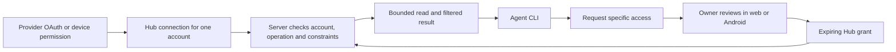

[English](personal-data-sources.md) | [简体中文](personal-data-sources.cn.md)

# Proposal: personal information sources for Agent Hub

Status: proposal only; no new connector is implemented by this document. Research date: 2026-09-19. Priorities and effort estimates below are product judgments, not provider commitments.

## Recommendation

Make **Google Calendar the next complete integration**, then choose a task or knowledge source based on actual use. The first useful result is: an agent checks selected work/personal calendars, receives only the approved information, and helps plan a day after approval on the web or Android app.

Treat the Hub as a permission broker and controlled data gateway. A growing list of provider logos is not proof of useful access. Retain multi-account support from the first connection, distinguish availability from event details, and avoid automatically copying every source into permanent storage.

## Verified starting point

The repository currently provides agent pairing, capability discovery, account discovery, operation requests, owner decisions, revocation, encrypted credentials, and a shared CLI. Executable adapters cover bounded Drive reads, Gmail reads, and Telegram Bot inspection. Google browser OAuth currently accepts only Drive and Gmail. Calendar, contacts, tasks, and Notion are not implemented. See [the Hub contract](../agent-hub.md) and [connector inventory](../hub-connectors.md).

Current grants cover one **account and operation**, without resource or time-window constraints. Before an approval can honestly promise “only my work calendar for this week,” server enforcement must be added. Android approval code exists, but real FCM delivery still needs deployment configuration and device acceptance; see [Android acceptance](../android-hub.md).

## Source landscape

“Next” means a strong follow-on candidate after the Calendar experiment, not a committed implementation backlog. Every account/workspace/device needs its own connection identity and authorization boundary. Links are primary documentation checked during this research.

| Source | Useful information | Integration and owner authorization | Boundary / recommendation |
| --- | --- | --- | --- |
| Google Calendar | Availability, appointments, recurring events | Calendar REST API; browser OAuth; distinct free/busy and event-read scopes | **First.** Existing Google infrastructure is reusable. Calendar selection must be enforced inside Hub. [Scopes](https://developers.google.com/workspace/calendar/api/auth), [availability](https://developers.google.com/workspace/calendar/api/v3/reference/freebusy/query). |
| Outlook / Microsoft 365 Calendar | Personal and work agendas | Microsoft Graph v1.0; delegated OAuth; `Calendars.ReadBasic` for basic fields, `Calendars.Read` when more is needed | **Next if actively used.** Personal accounts are supported; work tenants can impose consent policy. Use calendar views to expand occurrences. [Calendar view](https://learn.microsoft.com/en-us/graph/api/calendar-list-calendarview?view=graph-rest-1.0), [permissions](https://learn.microsoft.com/en-us/graph/permissions-reference). |
| Nextcloud / other CalDAV servers | Self-hosted calendars; CardDAV can separately supply contacts | Owner-configured server and application credential; CalDAV discovery and read reports | **Next for self-hosting.** A protocol is not one universal login. Pin allowed endpoints and validate discovery URLs. [CalDAV](https://www.rfc-editor.org/info/rfc4791/), [Nextcloud](https://docs.nextcloud.com/server/latest/user_manual/en/groupware/sync_android.html). |
| iCloud Calendar / Contacts | Apple calendar and address-book context | Evaluate CalDAV/CardDAV with app-specific credentials; Apple also documents account authorization for supported third-party apps | **Feasibility check first.** Do not assume that Apple sign-in grants calendar access or that Hub qualifies for the newer authorization route. No general iCloud Notes/Photos connector is promised. [Apple third-party access](https://support.apple.com/en-us/102654). |
| Google Tasks | Task lists, outstanding work, scheduled dates | Tasks API; OAuth `tasks.readonly`; on-demand reads first | **Next.** Small extension to Google onboarding. Do not model task due dates as calendar appointment times. [Scopes](https://developers.google.com/workspace/tasks/auth), [task representation](https://developers.google.com/workspace/tasks/reference/rest/v1/tasks). |
| Todoist | Tasks, projects, priorities, labels | Current API v1; OAuth `data:read`; encrypted token/refresh handling | **Next if this is the user's task manager.** Good read-only entry; use current APIs instead of assuming older REST/Sync versions remain the target. [API and OAuth](https://developer.todoist.com/api/v1/). |
| Microsoft To Do | Task lists and task details | Graph v1.0; delegated `Tasks.Read`; work and personal accounts | **Next with Microsoft Calendar.** Reuse Microsoft identity onboarding but obtain separate task consent. [Read tasks](https://learn.microsoft.com/en-us/graph/api/todotasklist-list-tasks?view=graph-rest-1.0). |
| Google Contacts | Names, email addresses, relationships recorded by the user | People API; `contacts.readonly`; request only required person fields | **Next when identity matching is useful.** A personal address book is distinct from an organization's directory. Do not merge people solely by display name. [Connections API](https://developers.google.com/people/api/rest/v1/people.connections/list). |
| Notion | Selected project pages, notes, structured records | Public OAuth with page selection; a self-hosted pilot can use an internal connection shared with selected pages | **Next knowledge source.** Fetch page/block content only within shared resources; public connection and API version setup require validation. [Authorization](https://developers.notion.com/guides/get-started/authorization), [webhooks](https://developers.notion.com/reference/webhooks). |
| OneDrive | Personal documents and file changes | Graph delegated file-read permissions; delta API when synchronization becomes necessary | **Later, or earlier for Microsoft users.** Reading metadata/content and downloading files need separate Hub operations. [Delta API](https://learn.microsoft.com/en-us/graph/api/driveitem-delta?view=graph-rest-1.0). |
| Dropbox | Files and documents | OAuth with explicit read scopes; choose App Folder or Full Dropbox access | **Later.** App Folder does not expose arbitrary existing files; scope disclosure must match the selected access type. [OAuth/access types](https://docs.dropboxapi.com/dropbox-api/docs/oauth). |
| Gmail / Google Drive | Correspondence and documents | Existing adapters and Google OAuth; complete live two-account acceptance before expanding | **Finish existing proof.** Broad read scopes can bring verification/security-assessment obligations depending on distribution and data handling. Assess per deployment. [Gmail scopes](https://developers.google.com/workspace/gmail/api/auth/scopes), [Drive scopes](https://developers.google.com/workspace/drive/api/guides/api-specific-auth). |
| Readwise Reader | Saved articles and reading context | Account API token; document listing, pagination and `updatedAfter` | **Later, relatively small adapter.** Token authorization can be broader than Hub's read operations; keep it server-side. Validate subscription/access on a test account. [Reader API](https://readwise.io/reader_api). |
| RSS / Atom / owner-selected exports | Subscriptions, articles, portable snapshots | Feed URLs or explicit file import; private feed URLs are credentials | **Later, low onboarding friction.** Feeds are not full website access; file imports are snapshots. Use bounded parsers and prevent server-side URL fetching from reaching unintended hosts. [RSS specification](https://www.rssboard.org/rss-specification). |
| GitHub | Issues, pull requests, development context | Prefer a GitHub App installed on selected repositories with read permissions | **Later, strong fit for coding agents.** Repository installation boundaries are useful; avoid a broad personal token as the default. [App selection guidance](https://docs.github.com/en/apps/creating-github-apps/about-creating-github-apps/deciding-when-to-build-a-github-app). |
| Slack | Selected conversations and work context | Workspace app installation and appropriate OAuth scopes; Events API or bounded history reads | **Later.** Visibility depends on token/channel membership; commercial distribution affects history API rate limits. Do not promise complete workspace history. [Rate limits](https://docs.slack.dev/apis/web-api/rate-limits/), [Conversations API](https://docs.slack.dev/apis/web-api/using-the-conversations-api/). |
| Telegram personal / WhatsApp | Personal or business conversation context | Telegram personal requires a user-authorized MTProto session; WhatsApp Business uses its business platform; personal exports are a separate import route | **Keep separate tracks.** A Telegram bot is not a personal account. WhatsApp Business is not a general personal-history API. [Telegram authorization](https://core.telegram.org/api/auth), [Meta Cloud API](https://www.postman.com/meta/whatsapp-business-platform/documentation/wlk6lh4/whatsapp-cloud-api). |
| Android Health Connect | Owner-selected health/fitness data types | Android device permission and native SDK; an explicitly authorized device bridge sends selected data to Hub | **Defer.** It is not a server OAuth source. Historical/background reads have additional permissions, and data availability depends on the device and contributing apps. [Read permissions](https://developer.android.com/health-and-fitness/health-connect/read-data). |
| Google Photos | Owner-selected photos | Photos Picker API for selecting existing user media | **Defer; selected import only.** Old whole-library read scopes were removed in 2025; do not design a full personal-library crawler around them. [API changes](https://developers.google.com/photos/support/updates). |

Feishu/Lark and DingTalk are relevant work-source candidates, but tenant installation, user-versus-application identity and actual account access need a separate feasibility pass. Feishu's dynamically rendered documentation was not readable enough in this pass to validate exact scopes. WeChat personal history, Apple Notes and arbitrary app-private phone data are not counted as supported sources without a verified official route or owner-export workflow.

## Access model



Provider consent authorizes **Hub**; a separate Hub grant authorizes **one agent**. Neither one replaces the other. Approval does not hand the agent the provider token. A provider token may allow more data than the Hub grant, so constraints must run before the upstream request and before response delivery.

Keep the current connection model: `owner_id + provider_id + verified account_id`, with a separate opaque `connection_id`. For providers with workspaces or tenants, include that identity in the verified account key. Google Calendar's account identity should use validated OpenID Connect `sub`; `email` is a display label, not the identity key. Add `openid email` for identity without requesting Gmail/Drive access simply to identify the user. Validate signature, issuer, audience, expiry and nonce using a maintained verifier. This is proposed new work, not current Calendar support. [Google OIDC](https://developers.google.com/identity/openid-connect/openid-connect).

Keep persistence modes visible:

| Mode | Default / use | Meaning |
| --- | --- | --- |
| On-demand read | First Calendar slice | Read approved data and return it; do not automatically append source content to permanent EDC events. |
| Incremental mirror | Later, explicit opt-in | Maintain an account/resource-scoped cache with freshness and deletion handling; background collection needs owner authorization of its own. |
| Owner-selected import | Exports or selected photos | Store a provenance-bearing snapshot; do not describe it as a live connection. |

Credentials remain encrypted in the identity database. Any later mirror is a rebuildable cache; imported event history follows EDC's append-only rules. Revoking access stops future Hub reads but cannot recall content an agent already received or erase existing backups. Self-hosting controls persistence location; an agent may still send approved content to its external model.

## First experiment: Google Calendar

### MVP card

- **Target user:** One owner with personal and work accounts, using one or more agents.
- **Job:** Check the coming week's agenda or find a free slot without exposing unrelated calendars or event details.
- **Riskiest assumption:** The approval card describes an enforceable, understandable scope that is useful to the agent.
- **Loop:** Connect two accounts → select calendars → agent discovers operations → requests a calendar/time window → phone or web approval → bounded read → revoke → next read fails.
- **Success proof:** Two real owner-authorized test accounts, known calendar fixtures and a complete CLI/approval flow; local adapter tests alone are insufficient.
- **No-gos:** No writes/invitations, no permanent calendar mirror, no attachment/contact reads, no account-wide access disguised as one-calendar access, no model dependency in Hub.
- **Appetite:** A five-engineering-day experiment after test accounts and OAuth setup are available. Reassess scope at the boundary; provider review and device/push setup are external dependencies, not a delivery promise.

### Proposed capabilities and consent

All names and constraints in this section are a proposal, not commands or operations available today.

| Hub operation | Upstream route / consent | Returned information |
| --- | --- | --- |
| `calendars.list` | `GET /users/me/calendarList`; `calendar.calendarlist.readonly` | Only calendars the owner selected for this connection; names and IDs require their own discovery/read grant. |
| `freebusy.query` | `POST /freeBusy`; prefer `calendar.events.freebusy` for accessible calendars | Busy intervals and explicit per-calendar errors; no titles, descriptions or attendees. |
| `events.list` | `GET /calendars/{id}/events`; `calendar.events.readonly` | Proposed `basic` projection: event ID, title, start/end, all-day/time-zone information and status; omit descriptions, attendees, meeting links and attachments. |

Scope names above omit the `https://www.googleapis.com/auth/` prefix. Offer availability-only onboarding first; event-detail access requires explicit additional provider consent and a different Hub operation grant. Check returned scopes rather than assuming requested scopes were granted. Shared-calendar visibility remains limited by provider ACLs. Owner calendar selection is a Hub restriction, not a narrower Google OAuth scope. [Scope reference](https://developers.google.com/workspace/calendar/api/auth), [calendar listing](https://developers.google.com/workspace/calendar/api/v3/reference/calendarList/list), [event listing](https://developers.google.com/workspace/calendar/api/v3/reference/events/list).

For an availability-only user who does not want to reveal calendar names to an agent, the owner can select the calendar while approving; `calendars.list` is not a mandatory grant.

### Minimum changes to existing code

1. Extend `backend/internal/hubconnectors/` with the three explicit Calendar operations and bounded schemas. Extend `google_oauth.go`, `backend/internal/core/hub_google.go` and `backend/internal/api/hub_google.go` for Calendar-specific scopes and verified identity. Reuse state, PKCE, browser binding, encryption and refresh logic; no new broker service.
2. Add validated grant constraints in the existing Hub request storage and execution path: approved calendar IDs, absolute `time_min/time_max`, and the operation's allowed field projection. Default to at most seven days of data and a one-hour grant. Reject missing/unknown constraints, other calendars, expanded windows and unsupported fields. Bind continuation tokens to the same owner, grant, connection, resource and query. Authorization lifetime and requested data dates are different fields.
3. Extend the existing CLI `access request` with a proposed `--constraints` JSON argument. Keep `capabilities`, `source list`, `access list` and `api call`. Return schemas plus authorization/setup status, without exposing provider credentials. This is an extension of the existing CLI, not a second tool.
4. Update `frontend/hub.js` and Android `AuthorizationsActivity` to show account, calendar, read mode, data date range and permission expiry. Reuse existing decision and notification flows. Example: “Planning Agent · Work account / Team calendar · busy intervals only · Sep 21–28, Asia/Singapore · permission expires in 1 hour.” Display agent-provided reasons separately from enforced scope.
5. Add focused tests and live acceptance below; update bilingual Hub docs when implementation is approved. Do not change existing connectors' permission semantics silently.

Proposed agent example, requiring the extensions above:

```sh
edc --config ./agent-private.json access request \
  --connection WORK_CALENDAR_CONNECTION --operation freebusy.query \
  --reason 'Find a 30-minute slot next week' --duration 1h \
  --constraints '{"calendar_ids":["primary"],"time_min":"2026-09-21T00:00:00+08:00","time_max":"2026-09-28T00:00:00+08:00"}'

edc --config ./agent-private.json api call \
  --connection WORK_CALENDAR_CONNECTION --operation freebusy.query \
  --args '{"calendar_ids":["primary"],"time_min":"2026-09-21T00:00:00+08:00","time_max":"2026-09-28T00:00:00+08:00"}'
```

Resolve `primary` to the verified calendar ID before storing the grant and display its human label. Owner selection must already allow it. The agent receives `authorization_required` until approval; expanding the dates or changing accounts must fail even if the provider token could perform the read.

### Acceptance and failure behavior

- Connect two distinct Google accounts; verify identity and labels, revoke/reconnect one without affecting the other.
- Approve one calendar/window. Other calendars, accounts, operations and wider windows fail. A free/busy grant cannot call event detail operations; `basic` event results contain only allowlisted fields.
- Verify all-day events, recurring instances, cancellation and daylight-saving transitions. Use explicit offsets and preserve the calendar time zone. Define agenda access as events overlapping the approved window, disclose that boundary, and clip returned busy intervals to it. Treat event titles and other provider content as untrusted data, never as instructions. Handle per-calendar free/busy errors as unknown availability, never “free.” Pagination must not hide later events or imply an incomplete page is complete.
- Validate no grant, denied/expired grant, logout/account switch, OAuth partial consent, revoked refresh token, provider quota errors and revocation during an in-flight read. Return actionable setup/authorization/provider errors separately.
- Prove browser or phone approval → CLI read → revoke → denied next read against real test accounts. For the requested phone experience, separately prove a real background notification on the chosen device; until then report web approval and push status independently.
- Automated baseline: connector/core/API tests plus applicable `make check`, `make build`, web tests and Android tests/build. Record real consent and device evidence separately.

## Deferred decisions and operating costs

Choose the next source after this experiment using actual demand: **Tasks/Todoist** for planning, **Notion** for knowledge, **Microsoft Calendar** for cross-provider scheduling, or **CalDAV** for self-hosting. Do not start all four in parallel solely because APIs exist.

Provider change notifications and owner approval notifications are different systems. Calendar webhooks signal changes and require an HTTPS receiver and channel renewal; they do not deliver full events. A future mirror would combine notifications with incremental synchronization and periodic reconciliation. Google sync tokens can invalidate with `410`; reset the derived cache/cursor and rebuild it without deleting immutable imported history. [Notifications](https://developers.google.com/workspace/calendar/api/guides/push), [incremental sync](https://developers.google.com/workspace/calendar/api/guides/sync). Microsoft has a separate calendar-view delta mechanism. [Graph delta](https://learn.microsoft.com/en-us/graph/api/event-delta?view=graph-rest-1.0).

The primary costs are OAuth registration/review, real-account acceptance, provider-specific edge cases, credential lifecycle and ongoing API changes. There is no researched basis here for a fixed monthly cost or universal approval time. Self-hosted users should be able to supply their own application credentials; a managed public deployment needs its own provider review. Existing Android push setup remains a separate prerequisite.

Resource restrictions, freshness, rate-limit behavior and visible audit records will matter more than connector count. Log account/operation/decision/result metadata rather than event bodies or access tokens. Before adding health data, broad history or write actions, define a separate user-approved scope and acceptance loop. This proposal authorizes no new collection, login, deployment or public publication.
