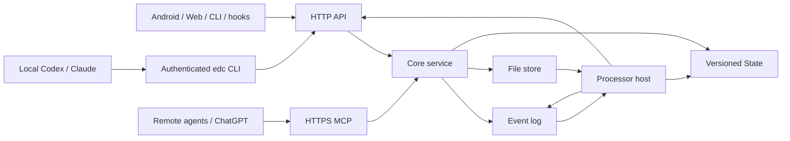

# Event-driven Context V2 Technical Design

English | [简体中文](technical-design.cn.md)

Version: 2.0 · Date: 2026-09-12 · Status: Target design, to be implemented and validated step by step

This document maps the capabilities in [Product Design V2](product-V2.md) to a unified data model and public interfaces. Public fields and behavior follow Section 7 of Product Design V2; the development agent determines the internal storage layout, runtime parameters, and framework choices based on the existing code, and validates them with the same set of contract tests. Current progress and evidence are recorded in [V2 Implementation and Review](v2-implementation.md); this document does not describe design targets as completed capabilities.

The previous design is preserved in full in [technical-design-v1.md](archive/technical-design-v1.md). V2 does not substitute renamed versions of the previous `query_context`, backend task coordinator, or inbox for the Event, File, State, and plugin model.

## 1. Design Goals

The system turns conversations, quick notes, and recordings within the same project into a traceable append-only record and lets different clients see consistent project state. The core provides only factual storage, authorization, and concurrency boundaries; transcription, briefs, evidence retrieval, and daily reviews are provided by replaceable plugins.

P1 must form one complete path:

1. The App, CLI, hook, remote MCP, or HTTP appends an Event to the same project; files are uploaded as Files first.
2. Plugin processors read incrementally by sequence and, within their own permissions, append derived Events or publish State.
3. A new session reads the project brief, queries original evidence when needed, and writes new decisions back as Events.
4. The Web first completes the primary flow for shared projects, restorable routing, and central login; Android then displays sync status, transcripts, and review State published by date.

Core semantic search, vector databases, image-analysis execution, external publishing, reminder recommendations, cross-project features, and a plugin marketplace are not included in P1.

## 2. System Responsibilities

- **Core service**: Authenticates project identity, appends and queries Events, stores Files and State, and manages plugin installation and least privilege. It does not run models or plugin business logic.
- **HTTP and MCP**: These are transport adapters for the same service capabilities and must return the same UUIDs, sequences, versions, authorization results, and error semantics. Local Codex / Claude Code uses HTTP through the `edc` CLI; HTTPS MCP is only for remote clients such as ChatGPT.
- **CLI, Web, and Android**: Work only through public interfaces and do not read the server data directory; clients may declare source, while actor, producer, and plugin permissions are determined by server authentication.
- **Hook**: Captures client session events and invokes the CLI; explicit confirmation is required before it is enabled for a shared project.
- **Processor host**: Runs processors with plugin tokens. It does not advance the cursor on failure or treat request acceptance as successful processing.

## 3. Unified Data Model

### Project

A Project is the boundary for Events, Files, State, plugins, and member permissions, and stores the IANA time zone used to interpret dates and scheduled runs. `timezone` may be omitted at creation, in which case the server defaults to `UTC`; an owner can update it with `PATCH /v1/projects/{project_id}`, which directly returns the Project on success. Plugin introspection returns the current `project_timezone` so every processing run uses time semantics consistent with the project; no MCP mutation tool is added in this iteration.

A Project is also the sharing boundary for team context. A project can have multiple owners; any owner can add a member by an exact registered username or email, and can promote another member to owner or demote one to an ordinary member. The add interface must provide exactly one identifier, offers no fuzzy search, and does not return the target email to the caller. The server guarantees transactionally that a project retains at least one owner. The project list is returned according to the current signed-in user's memberships and returns the complete owner set through `owner_user_ids`; `owner_user_id` is temporarily retained as the original-owner field for legacy clients. After joining, members can use HTTP, MCP, CLI, Web, or the App to read the same Events, Files, and public State, and can append Events to the same project.

The Web represents the current project and section with `?project=<project_id>#<view>` and can use that URL as a share link among members. Server-side membership permissions remain the access boundary; an unknown or unauthorized project must not fall back to another project in the list.

### Event

An Event is an immutable project record and has one of three types: `log`, `note`, or `derived`. The writer supplies the UUID; the server adds the sequence, recorded_at, and authenticated actor.

- The actor of a user Event is fixed to the current signed-in user's `type=user`, user ID, and username; the actor of a plugin Event is fixed to `type=plugin`, the plugin ID, and `on_behalf_of`. EventInput does not expose an actor field that the caller can set.
- The same UUID and same canonical content within a project returns `duplicate`; different content returns `conflict`.
- metadata and source are declarations by the writer and cannot change the actor, permissions, or trust level.
- refs can only point to existing Events in the same project and express supersession, retraction, completion, derivation, and replies.
- Only a plugin identity may write `derived`, subject to the installation manifest.
- Batch writes return a result for each item; partial failure must not roll back successful items or be reported by the client as whole-batch success.

### File

A File stores the original bytes referenced by an Event. Uploads are deduplicated by “project + SHA-256,” and reads always recheck project permissions and never generate long-lived public links.

- The client uploads a File first, then appends an Event using the returned `file_id`.
- Both server and client verify the size, digest, and allowed media type.
- Unreferenced files may be removed according to the retention policy; files referenced by Events must not be lost to concurrent cleanup.
- HTTP supports streaming transfer for larger files; MCP only carries size-limited small files encoded as base64.

### State

State is a rebuildable project view published by a plugin, not an original record. Its key uses `<plugin_id>/<name>`; every publish creates a new version and preserves history.

- `expected_version` provides optimistic concurrency control; a mismatch returns a version conflict without overwriting the old version.
- `based_on_sequence` and the project's latest sequence define lag, which every client uses with the same meaning to show “up to date” or “records still awaiting processing.”
- refs point to the Events that produced the State, allowing the interface to navigate from State back to the original content.
- State whose name begins with `_` is readable only by its owning plugin and is used for cursors and internal processor state.

### Plugin

A plugin manifest fixes the version, skill, State, processor entry point, configuration, and permissions. Installation creates a token scoped to the project and plugin; changing configuration creates a revision, while pausing or uninstalling immediately blocks subsequent reads and writes. Existing Events and State remain intact.

Plugins extend only three capabilities: appending derived Events, publishing their own State, and providing skills to agents. P1 plugins cannot register additional HTTP routes or MCP tools.

## 4. Capability-to-Interface Mapping

| Capability | HTTP | MCP | CLI / App Usage |
|---|---|---|---|
| Identity | Integ.Life start/callback, logout, me; CLI-compatible register/login | Not exposed | The Web uses the Context HttpOnly Session; the CLI and hook use the CLI's private Bearer token; remote MCP uses OAuth or a private Bearer token |
| Projects and members | projects, project timezone, project members | list/create projects, list/add members | An owner adds a registered member by exact username or email; members see and read/write the same project through every entry point; Project responses always include timezone |
| Append records | Batch writes to project events | `record_events` | `edc push`, the hook, and the App share UUID and per-item result rules |
| Queries and original content | events query, event get, metadata | `query_events`, `get_event`, `list_metadata` | The Web, skills, and `edc query/get/pull` use the same filters and cursors |
| Files | multipart upload, authenticated original download | `upload_file`, `get_file` | Android and `edc push --file` upload a File before writing an Event |
| State | list, get by key/version, put | `list_state`, `get_state`, `put_state` | App reviews, session context, Web state, and CLI use the same version and lag |
| Plugin management | install, list, patch, run, delete | Not exposed | The Web, App, and CLI manage installations; processors hold only plugin tokens |
| Conversation integration | Local agents invoke HTTP through the CLI; remote agents use `/mcp` | Standard remote toolset | Local Codex / Claude Code executes `edc` directly; it does not register MCP; `edc mcp` is retained only for compatibility |

Project, Event, File, State, and plugin identifiers must also appear in the path or authentication boundary. Adapters must not trust only the project, actor, producer, or plugin ID in a request body; responses must also prevent data from another project from being treated as a successful result.

All query conditions are combined with AND, and results default to ascending sequence order; callers may explicitly request descending order, which the Web record list uses to display the newest content first. A pagination cursor fixes the first-page snapshot and ordering, while `after_sequence` is used for pulls and incremental processor reads. HTTP, MCP, and CLI must observe identical Event content and ordering for identical input.

## 5. Critical End-to-End Flows

### Text, Sessions, and Batch Writes

The CLI, hook, and skill generate stable UUIDs before writing. Retries reuse the original UUID; every JSONL item retains its own success, duplicate, or failure result. Directory binding, hook installation, and the persistent outbox are already integrated into this path; input is retained after network failure and sent when connectivity recovers.

On SessionStart, the hook reads the `session_context` State declared by the plugin. Subsequent evidence queries still read Events; State cannot replace original content or conceal lag.

### Android Recording

Android generates a stable capture UUID when recording starts and persists the account, project, file, and pending-upload state. Once the local file is closed and readable, it enters the queue:

1. Upload the File and verify the size and SHA-256 returned by the server.
2. Use the capture UUID to append a note Event referencing that `file_id`.
3. Mark server synchronization complete only after the Event succeeds or returns duplicate.
4. On expired login, loss of connectivity, process interruption, or a lost acknowledgment, retain the same queue item and retry it.

A successfully uploaded File remains pending synchronization until its Event is confirmed. Switching accounts must not send the old account's queue, and transcription failure must neither delete nor prevent playback of the original recording.

### Plugin Processing

The processor host stores its cursor in plugin-private State and pulls input using `after_sequence`. The current transcription-output UUID is determined stably by the project, plugin, input Event, and output slot; State is published with expected_version. The cursor is updated after successful output, and a failed input is not skipped. A new generation for historical retranscription is not yet implemented.

When an agent or processor organizes team records, it uses `actor` to determine the writer and preserves the original Event through refs. `source.channel` identifies only the ingestion channel; when an old conversation is imported, the account performing the import remains the actor, while the original conversation role belongs in source or metadata and must not impersonate an authenticated member's speech. When briefs, conflicts, and reviews need to distinguish members' statements, they should display each member's username and allow the original Event to be opened.

The manual run interface means only that a request has been durably accepted. Actual execution, retries, error status, and usage are presented by the host and plugin state; the Core does not pretend that synchronous completion occurred.

## 6. Four P1 Plugins

| Plugin | Input and Output | Consistency Requirements |
|---|---|---|
| `audio-transcribe` | Audio File Event → derived transcript referencing the original recording | Preserve the original language; do not advance the cursor on failure; generation for historical reruns remains to be implemented |
| `project-brief` | Event → `project-brief/current` State | Decisions, constraints, tasks, and questions all include sources; conflicts are not automatically resolved in favor of the latest entry |
| `daily-review` | Events within the scheduled time range → dated State | Separate progress, decisions, tasks, questions, and suggestions; recordings awaiting transcription remain visible; missed runs follow product rules |
| `evidence` | An agent reads the brief and queries Events | Return sources, conflicts, gaps, and query scope; do not present State or a summary as independent original evidence |

The Web, Android, CLI, and conversational agents read these same outputs. User corrections take effect by appending notes with refs, not by editing State directly.

## 7. Identity, Permissions, and Errors

User tokens operate according to project membership and are restricted by OAuth scopes. A plugin token is fixed to one installation, project, version, and permission set; every operation rechecks pause, uninstall, and revision status.

By default, the Web enters the central Integ.Life Google login from the Context backend. The product backend generates and validates PKCE/state, reads the centrally confirmed email, and then issues its own host-only HttpOnly Session; all browser API and file requests carry that cookie, and the central token never enters a frontend URL or storage. `return_to` accepts only same-origin relative paths for the product and preserves the project query, current view hash, and locale. CLI Bearer login remains compatible.

Local users are uniquely bound by `(issuer, sub)`. Creation is rejected when a new user lacks a centrally confirmed email; on an existing user's first binding, a manually confirmed email can match the original ID, after which the sub is fixed. Both `songyy` and `cwhy` are bound to their original IDs; their existing Projects, memberships, and Event actors are neither migrated nor recreated. Actual email addresses are retained only in controlled migration evidence and worklogs.

- Ordinary users cannot impersonate a plugin through request fields to write `derived` or producer.
- A plugin can read only Events allowed by its manifest, reference readable Events, and write to its own State namespace.
- When a project owner publishes State on behalf of an installed plugin, the request must still pass an explicit `as_plugin_id` authorization check.
- Logs must not contain tokens, original audio/video, or complete model output.

Every entry point uses the same stable error semantics: unauthenticated, forbidden, not found, conflict, too large, invalid reference, unsupported media, State version conflict, forbidden namespace, and plugin paused. The UI maps error codes to the current language; unknown errors retain diagnostic information but must not display tokens or rewrite failure as success.

## 8. Product-State Consistency

The same facts use consistent states across the Web, Android, and CLI:

- Saved locally, File uploaded, Event synchronized, plugin processing, and State updated are distinct stages.
- duplicate is successful confirmation; conflict and partial batch failure require retaining the original input and prompting for resolution.
- State lag, plugin pause, processing failure, truncated output, and insufficient query scope must be shown explicitly.
- source and actor are displayed separately; agent notes, a user's original words, plugin-derived content, and State must not impersonate one another.
- The team Event view displays the actor username (and ID when needed), recorded_at, and source channel; the project-members entry point displays current members and allows an owner to add a registered username.
- All four target languages cover the same flows, validation, errors, empty states, and cross-page selection; generated-content language is controlled by plugin configuration, while transcription preserves the original language.

The Web first provides project records, project state, integration, member sharing, restorable URL routing, and plugin management. After the primary Web flow, Android continues to provide Record, Review, and Mine, reusing the same project, plugin, and State interfaces. The interface prioritizes names and results that users can understand; IDs are used for provenance and diagnosis.

## 9. Implementation Order and Current Boundaries

Validation proceeds according to the dependencies in Product Section 10.2; the current platform priority has been adjusted to complete Web sharing, routing, and central login before continuing Android device validation. Completed Android code and emulator evidence are retained but do not prove completion of Web capabilities that are not yet live.

At the user's request, features with defined public contracts may be developed in parallel by different agents, with continuous review by GPT-6; a later step cannot use an unvalidated prerequisite as proof of completion. The status of each current item is defined by `v2-implementation.md`; old P1 code and tests are historical reference only.

The current processor host supports one-time processing with `edc host run --once` and continuous checks with `--watch`. With a plugin token, it reads the current Installation, project time zone, and configuration, then publishes a transcript-derived Event, project brief, or daily-review State through public interfaces; the CLI, Web, Android, and MCP read the same content, versions, and sources.

`daily-review` processes the most recently due scheduled window in the project's time zone at the configured time (21:00 by default), filters records between adjacent schedule points by `recorded_at`, and publishes `daily-review/YYYY-MM-DD`. A delayed startup does not shift the window; published dates remain unchanged, and retries can recover completed status from State. When multiple periods are missed offline, it catches up only the most recent period and records the skipped dates; it also publishes an explanation for an empty day. Late transcripts enter the next period. Window information is stored with the dated State, and the App and Web display it by the date in its key and can open refs.

Production has verified real scheduled publishing, no rewrites from duplicate ticks, and dated-review source navigation in the Web and Android emulator. Consumption of the plugin-private `_requests`, generation for manual retranscription, and physical-phone validation are still incomplete; the manual run interface currently only accepts requests durably.
## 10. Contract Validation

Under the user's latest decision, MVP validation prioritizes the normal end-to-end loop, actual outputs, and cross-client readability. Security hardening and extreme-input tests are not currently release gates. The following scope is retained for later complete contract checks, and existing evidence need not be rerun:

- Event UUID deduplication and conflicts, per-item batch results, same-project refs validation, and snapshot pagination;
- File-before-reference, digest deduplication, cross-project isolation, and matching download bytes and digests;
- State version history, expected_version conflicts, lag, and private namespaces;
- Plugin-token least privilege, immediate invalidation on pause and uninstall, and non-forgeable management identity;
- Matching UUIDs, sequences, content, versions, and errors after round trips of the same data through HTTP, MCP, and CLI.
- Two real members read and write the same project through different entry points; when member A reads member B's Event, it still retains member B's actor ID, username, and server-side recorded_at; the Web displays the same author, and agent output preserves the source and required attribution.

There is already evidence of real Claude hook injection, retrieval by Codex as a second client, recorder write-back, ASR/brief processing, and actual scheduled reviews. Complete P1 still requires the manual-processing loop, a physical phone, the remaining four-language/OAuth scenarios, and sustained real-world use; existing synthetic validation cannot substitute for this evidence.
