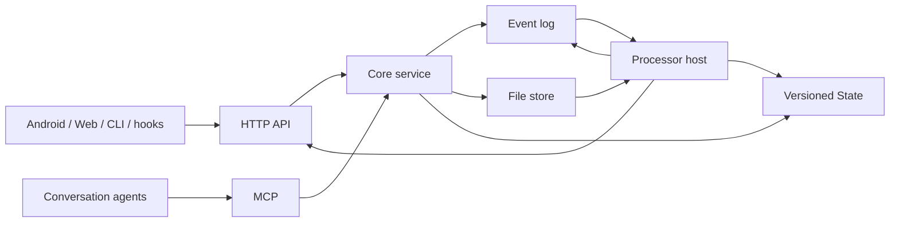

# Event-driven Context V2 技术设计

版本：2.0 · 日期：2026-09-12 · 状态：目标设计，按步骤实现与验收

本文把 [产品设计 V2](product-V2.md) 的功能映射到统一的数据和公开接口。公开字段和行为以产品 V2 第 7 节为准；内部存储布局、运行参数和框架选择由开发 Agent 根据现有代码确定，并用同一组契约测试验证。当前进度与证据记录在 [V2 实施与审查](v2-implementation.md)；本文不把设计目标描述成已完成能力。

旧版设计完整保留在 [technical-design-v1.md](archive/technical-design-v1.md)。V2 不以旧版 `query_context`、后端任务协调器或 inbox 改名代替 Event、File、State 与插件模型。

## 1. 设计目标

系统让同一项目的对话、随手记和录音形成可追溯的追加记录，并让不同客户端看到一致的项目状态。核心只提供事实存储、权限和并发边界；转录、概况、证据检索和每日回顾由可替换插件提供。

P1 必须形成一条完整路径：

1. App、CLI、hook、MCP 或 HTTP 向同一项目追加 Event；文件先作为 File 上传。
2. 插件处理器按 sequence 增量读取，在自己的权限内追加 derived Event 或发布 State。
3. 新会话读取项目概况，需要时查询原始证据，并把新决定作为 Event 写回。
4. Android App 展示同步状态、转录和按日期发布的回顾 State。

核心语义检索、向量库、图片分析执行、外部发布、提醒推荐、跨项目和插件市场不进入 P1。

## 2. 系统职责

- **Core service**：认证项目身份，追加与查询 Event，保存 File 和 State，管理插件安装与最小权限。它不运行模型或插件业务逻辑。
- **HTTP 与 MCP**：是同一服务能力的传输适配器，必须返回相同的 UUID、sequence、版本、权限结果和错误含义。
- **CLI、网页与 Android**：只通过公开接口工作，不读取服务端数据目录；客户端可声明 source，actor、producer 和插件权限由服务端认证确定。
- **Hook**：捕获客户端会话事件并调用 CLI；共享项目启用前必须明确确认。
- **Processor host**：持插件令牌运行处理器。失败时不推进游标，不把请求受理当作处理成功。

## 3. 统一数据模型

### Event

Event 是不可覆盖的项目记录，分为 `log`、`note`、`derived`。写入方提供 UUID；服务端补充 sequence、recorded_at 和经过认证的 actor。

- 同项目同 UUID、同规范内容返回 `duplicate`；内容不同返回 `conflict`。
- metadata 与 source 是写入方声明，不能改变 actor、权限或可信级别。
- refs 只能指向同项目已有 Event，用于表达取代、撤回、完成、派生和回复。
- `derived` 只允许插件身份写入，并受安装清单约束。
- 批量写入逐条返回结果；局部失败不能回滚已成功项，也不能被客户端报告为整批成功。

### File

File 保存 Event 引用的原始字节。上传按“项目 + SHA-256”去重，读取始终重新检查项目权限，不生成长期公开链接。

- 客户端先上传 File，再用返回的 `file_id` 追加 Event。
- 服务端和客户端都核对大小、摘要和允许的媒体类型。
- 未引用文件可按保留策略清理；已被 Event 引用的文件不能因并发清理丢失。
- HTTP 支持较大文件流式传输；MCP 只承载限定大小的 base64 小文件。

### State

State 是插件发布的可重建项目视图，不是原始记录。key 使用 `<plugin_id>/<name>`，每次发布产生新版本并保留历史。

- `expected_version` 提供乐观并发控制；不匹配返回版本冲突且不覆盖旧版本。
- `based_on_sequence` 与项目最新 sequence 形成 lag，所有客户端用同一含义展示“已是最新”或“仍有记录未处理”。
- refs 指向形成该状态的 Event，界面可由 State 回到原文。
- 名称以 `_` 开头的 State 仅所属插件可读，用于游标和处理器内部状态。

### Plugin

插件清单固定版本、skill、State、处理器入口、配置与权限。安装生成项目和插件限定的令牌；修改配置产生修订，暂停或卸载立即阻止后续读写，既有 Event 与 State 保留。

插件只扩展三种能力：追加 derived Event、发布自己的 State、向 agent 提供 skill。P1 插件不能注册额外 HTTP 路由或 MCP 工具。

## 4. 功能与接口映射

| 功能 | HTTP | MCP | CLI / App 使用方式 |
|---|---|---|---|
| 身份 | register、login、logout、me | 不暴露 | CLI 保存私有 token；网页与 App 使用各自认证流程 |
| 项目与成员 | projects、project members | list/create projects，list/add members | 所有项目选择与成员结果一致 |
| 追加记录 | project events 批量写入 | `record_events` | `edc push`、hook、App 共享 UUID 与逐项结果规则 |
| 查询与原文 | events query、event get、metadata | `query_events`、`get_event`、`list_metadata` | 网页、skill、`edc query/get/pull` 使用同一筛选和游标 |
| 文件 | multipart upload、认证原始下载 | `upload_file`、`get_file` | Android 与 `edc push --file` 先传 File 再写 Event |
| State | list、按 key/version get、put | `list_state`、`get_state`、`put_state` | App 回顾、会话背景、网页状态与 CLI 使用同一版本和 lag |
| 插件管理 | install、list、patch、run、delete | 不暴露 | 网页、App 与 CLI 管理安装；处理器只持插件令牌 |
| 对话接入 | `/mcp` | 标准工具集 | `edc mcp` 提供同一工具实现的 stdio 入口 |

项目、事件、文件、State 和插件的标识必须同时出现在路径或认证边界内。适配器不得仅相信请求体中的项目、actor、producer 或 plugin ID；响应也要防止把另一个项目的数据当成成功结果。

查询条件全部按 AND 组合，结果按 sequence 升序。分页 cursor 固定第一页快照，`after_sequence` 用于 pull 与处理器增量读取。HTTP、MCP 和 CLI 对相同输入必须观察到相同的事件内容与顺序。

## 5. 关键端到端流程

### 文本、会话与批量写入

CLI、hook 和 skill 在写入前生成稳定 UUID。重试复用原 UUID；JSONL 的每一项保留自己的成功、重复或失败结果。完整离线 outbox、目录绑定和 hook 安装属于实施步骤 ②，在完成前相关命令必须明确失败，不能静默跳过。

SessionStart 由 hook 读取插件声明的 `session_context` State。后续证据查询仍读取 Event；State 不能替代原文或掩盖 lag。

### Android 录音

Android 在录制开始时生成稳定 capture UUID，并把账户、项目、文件和待上传状态持久化。本机文件关闭且可读取后进入队列：

1. 上传 File 并校验服务端返回的大小和 SHA-256。
2. 使用 capture UUID 追加引用该 `file_id` 的 note Event。
3. 只有 Event 成功或 duplicate 后才标记服务端同步完成。
4. 登录过期、断网、进程中断或回执丢失时保留同一队列项并重试。

文件上传成功但 Event 未确认时仍是待同步状态。账号切换不能发送旧账号队列，转录失败也不能删除或阻止播放原录音。

### 插件处理

Processor host 用插件私有 State 保存游标，通过 `after_sequence` 拉取输入。输出 Event UUID 由插件、输入、输出槽位和版本稳定决定；发布 State 时带 expected_version。只有输出与游标更新都成功后才算推进。

手动 run 接口只表示请求已持久接受。实际执行、重试、错误状态和用量由 host 与插件状态呈现，不由 Core 假装同步完成。

## 6. P1 四个插件

| 插件 | 输入与输出 | 一致性要求 |
|---|---|---|
| `audio-transcribe` | 音频 File Event → 引用原录音的 derived 转录 | 保留原语言；失败不推进游标；重跑产生稳定的新 generation |
| `project-brief` | Event → `project-brief/current` State | 决定、约束、待办、问题均带来源；冲突不按时间自动选边 |
| `daily-review` | 计划时间范围内的 Event → 日期 State | 进展、决定、待办、问题、建议分开；待转录录音可见；错过运行按产品规则处理 |
| `evidence` | agent 读取概况并查询 Event | 返回来源、冲突、缺口与查询范围，不把 State 或摘要伪装成独立原始证据 |

网页、Android、CLI 和对话 agent 读取的是这些相同产物。用户纠正通过追加带 refs 的 note 生效，不直接编辑 State。

## 7. 身份、权限与错误

用户令牌按项目成员身份工作，并受 OAuth scope 限制。插件令牌固定到一个安装、项目、版本和权限集合；每次操作都重新检查暂停、卸载与修订状态。

- 普通用户不能通过请求字段冒充插件写 `derived` 或 producer。
- 插件只能读取清单允许的事件、引用可读事件，并写自己的 State 命名空间。
- 项目 owner 代表已安装插件发布 State 时仍要通过显式的 `as_plugin_id` 授权检查。
- 日志不得包含 token、原始音视频或完整模型输出。

所有入口使用同一稳定错误含义：认证失败、禁止、找不到、冲突、过大、非法引用、不支持媒体、State 版本冲突、命名空间禁止和插件暂停。UI 将错误码映射成当前语言；未知错误保留可诊断信息，但不能显示 token 或把失败状态改写成成功。

## 8. 产品状态一致性

同一事实在网页、Android 与 CLI 上使用一致状态：

- 本机已保存、File 已上传、Event 已同步、插件处理中、State 已更新是不同阶段。
- duplicate 是成功确认；conflict 和批次局部失败需要保留原输入并提示处理。
- State lag、插件暂停、处理失败、输出截断和查询范围不足必须明确展示。
- source 与 actor 分开显示；agent note、用户原话、插件 derived 和 State 不能互相冒充。
- 四种目标语言覆盖同一流程、校验、错误、空状态和跨页选择；生成内容语言由插件配置决定，转录保留原语言。

网页提供项目记录、项目状态、接入和插件管理。Android 提供记录、回顾、我的，并复用相同项目、插件和 State 接口。界面优先显示用户可理解的名称与结果，ID 用于来源和诊断。

## 9. 实施顺序与当前边界

验收按产品第 10.2 节的依赖推进：① 数据和公开接口；② CLI/hook/setup/outbox；③ 项目概况与第二客户端；④ processor host 与转录；⑤ Android 可靠采集；⑥ 实际定时回顾；⑦ 网页与四语言。

根据用户要求，公开契约已定义的功能可由不同 Agent 并行开发，GPT-6 持续审核；后一步不能用未验收的前置能力作完成证明。当前每项状态以 `v2-implementation.md` 为准；旧 P1 代码与测试只能作为历史参考。

当前 processor host 只实现显式的 `edc host run --once`：它用插件令牌读取该插件自己的当前 Installation 与配置，从私有 `_cursor` 之后按清单类型拉取 Event，执行有超时的 agent 或 command，校验来源后发布 `project-brief/current` State 或 `audio-transcribe` derived Event，最后以 expected version 推进 `_cursor`；执行失败时不推进游标。输出仍通过同一套 Event、State 和插件身份接口读取，因此 CLI、网页与 MCP 观察到的内容、版本和来源一致。外部 cron 可以重复调用这个单次命令，但 host 本身不会常驻或解释清单中的 schedule。

内建定时调度、`daily-review` 的日期窗口执行，以及消费或确认插件私有 `_requests` 尚未实现。当前 manual run 接口只持久接受请求；清单中的 schedule 与 `_requests` 声明不能作为这些能力已运行的证明。

## 10. 契约验收

当前按用户最新决定，MVP 验收优先正常闭环、实际产出和跨客户端可读。安全加固与极端输入测试暂不作为发布门槛。以下保留为后续完整契约检查范围，已有证据不必重复执行：

- Event UUID 去重与冲突、批量局部结果、refs 同项目校验、快照分页；
- File 先传后引用、摘要去重、跨项目隔离、下载字节与摘要一致；
- State 历史版本、expected_version 冲突、lag 与私有命名空间；
- 插件令牌最小权限、暂停和卸载即时失效、管理身份不可伪造；
- 同一数据经 HTTP、MCP 和 CLI 往返后 UUID、sequence、内容、版本和错误一致。

完整 P1 还需真实 Claude Code hook、第二客户端、无人值守处理器、Android 真机断网恢复、实际定时回顾，以及四语言桌面、窄屏、手机和 OAuth 验证。构建通过、模拟数据或手动 run 不能替代这些端到端证据。
